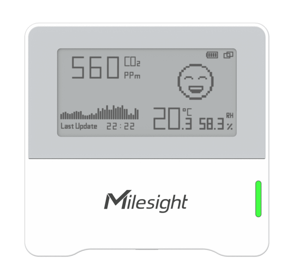

# Ambience Monitoring Sensors - Milesight IoT

The payload decoder function is applicable to AM103, AM103L

For more detailed information, please visit [milesight official website](https://www.milesight-iot.com).

|        AM103        |        AM103L         |
| :-----------------: | :-------------------: |
|  |  |

## Payload Definition

|     CHANNEL     |  ID  | TYPE | LENGTH | DESCRIPTION                                              |
| :-------------: | :--: | :--: | :----: | -------------------------------------------------------- |
|     Battery     | 0x01 | 0x75 |   1    | battery(1B)<br/>battery, unit: %                         |
|   Temperature   | 0x03 | 0x67 |   2    | temperature(2B)<br/>temperature, unit: ℃                 |
|    Humidity     | 0x04 | 0x68 |   1    | humidity(1B)<br/>humidity, unit: %RH                     |
|       CO2       | 0x07 | 0x7D |   2    | co2(2B)<br/>co2, unit: ppm                               |
| Historical Data | 0x20 | 0xCE |   9    | timestamp(4B) + temperature(2B) + humidity(1B) + co2(2B) |

## Example

```json
// 017564 03671801 04686D 077DC501
{
    "battery": 100,
    "co2": 453,
    "temperature": 28,
    "humidity": 54.5
}
```
