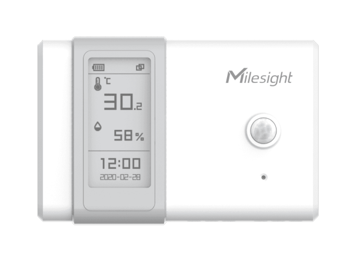

# Ambience Monitoring Sensors - Milesight IoT

The payload decoder function is applicable to AM104 (AM100).

For more detailed information, please visit [milesight official website](https://www.milesight-iot.com).



## Payload Definition

|   CHANNEL    |  ID  | TYPE | LENGTH | DESCRIPTION                                  |
| :----------: | :--: | :--: | :----: | -------------------------------------------- |
|   Battery    | 0x01 | 0x75 |   1    | battery(1B)<br/>battery, unit: %             |
| Temperature  | 0x03 | 0x67 |   2    | temperature(2B)<br/>temperature, unit: ℃     |
|   Humidity   | 0x04 | 0x68 |   1    | humidity(1B)<br/>humidity, unit: %RH         |
|   Activity   | 0x05 | 0x6A |   2    | activity(2B)                                 |
| Illumination | 0x06 | 0x65 |   6    | illumination(6B)<br/>illumination, unit: lux |

## Example

```json
// 01755C 03673401 046865 056A4900 06651C0079001400
{
    "battery": 92,
    "temperature": 30.8,
    "humidity": 50.5,
    "activity": 73,
    "illumination": 28,
    "infrared": 20,
    "infrared_and_visible": 121
}
```
