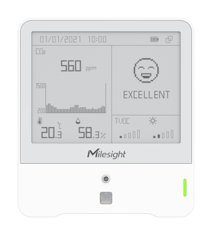

# Ambience Monitoring Sensors - Milesight IoT

The payload decoder function is applicable to AM307 and AM319.

For more detailed information, please visit [milesight official website](https://www.milesight-iot.com).

|        AM307        |        AM319        |        AM300L         |
| :-----------------: | :-----------------: | :-------------------: |
|  |  |  |

## Payload Definition

|           CHANNEL           |  ID  | TYPE | LENGTH | DESCRIPTION                                                                                                                                             |
| :-------------------------: | :--: | :--: | :----: | ------------------------------------------------------------------------------------------------------------------------------------------------------- |
|           Battery           | 0x01 | 0x75 |   1    | battery(1B)<br/>battery, unit: %                                                                                                                        |
|         Temperature         | 0x03 | 0x67 |   2    | temperature(2B)<br/>temperature, unit: ℃                                                                                                                |
|          Humidity           | 0x04 | 0x68 |   1    | humidity(1B)<br/>humidity, unit: %RH                                                                                                                    |
|             PIR             | 0x05 | 0x00 |   1    | pir(1B)                                                                                                                                                 |
|         Light Level         | 0x06 | 0xCB |   1    | light_level(1B)                                                                                                                                         |
|             CO2             | 0x07 | 0x7D |   2    | co2(2B)<br/>co2, unit: ppm                                                                                                                              |
|            tVOC             | 0x08 | 0x7D |   2    | tvoc(2B)                                                                                                                                                |
|          Pressure           | 0x09 | 0x73 |   2    | pressure(2B)<br/>pressure, unit: hPa                                                                                                                    |
|            HCHO             | 0x0A | 0x7D |   2    | hcho(2B)<br/>hcho, unit: mg/m3                                                                                                                          |
|            PM2.5            | 0x0B | 0x7D |   2    | pm2_5(2B)<br/>pm2_5, unit: ug/m3                                                                                                                        |
|            PM10             | 0x0C | 0x7D |   2    | pm10(2B)<br/>pm10, unit: ug/m3                                                                                                                          |
|             O3              | 0x0D | 0x7D |   2    | o3(2B)<br/>o3, unit: ppm                                                                                                                                |
|            Beep             | 0x0E | 0x01 |   1    | beep(1B)                                                                                                                                                |
| Historical Data<br/>(AM307) | 0x20 | 0xCE |   16   | timestamp(4B) + temperature(2B) + humidity(2B) + pir(1B) + light_level(1B) + co2(2B) + tvoc(2B) + pressure(2B)                                          |
| Historical Data<br/>(AM308) | 0x20 | 0xCE |   20   | timestamp(4B) + temperature(2B) + humidity(2B) + pir(1B) + light_level(1B) + co2(2B) + tvoc(2B) + pressure(2B) + pm2_5(2B) + pm10(2B)                   |
| Historical Data<br/>(AM319) | 0x20 | 0xCE |   22   | timestamp(4B) + temperature(2B) + humidity(2B) + pir(1B) + light_level(1B) + co2(2B) + tvoc(2B) + pressure(2B) + pm2_5(2B) + pm10(2B) + CH2O(2B)/O3(2B) |

## Example

```json
// 0367EE00 04687C 050001 06CB02 077DA803 087D2500 09736627 0A7D0400 0B7D2000 0C7D3000
{
    "temperature": 23.8,
    "humidity": 62,
    "pir": "trigger",
    "light_level": 2,
    "co2": 936,
    "tvoc": 37,
    "pressure": 1008.6,
    "hcho": 0.04,
    "pm2_5": 32,
    "pm10": 48
}
```
