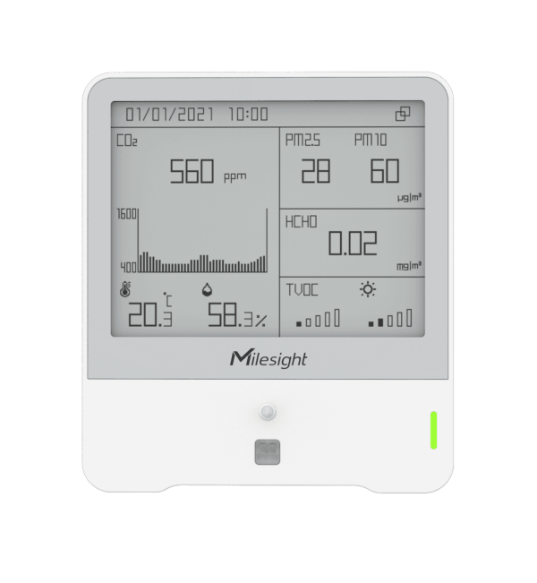

# Ambience Monitoring Sensors - Milesight IoT

The payload decoder function is applicable to AM307 and AM319.

For more detailed information, please visit [milesight official website](https://www.milesight-iot.com).

|        AM307        |        AM319        |        AM300L        |
| :-----------------: | :-----------------: | :-----------------: |
|  |  |  |

## Payload Definition

|           channel            | channel_id | channel_type | data_length (bytes) | description                                                                                                                                            |
| :--------------------------: | :--------: | :----------: | :-----------------: | ------------------------------------------------------------------------------------------------------------------------------------------------------ |
|           battery            |    0x01    |     0x75     |          1          | unit: %                                                                                                                                                |
|         temperature          |    0x03    |     0x67     |          2          | unit: ℃                                                                                                                                                |
|           humidity           |    0x04    |     0x68     |          1          | unit: %RH                                                                                                                                              |
|             PIR              |    0x05    |     0x00     |          1          | unit:                                                                                                                                                  |
|         light_level          |    0x06    |     0xCB     |          1          | unit:                                                                                                                                                  |
|             CO2              |    0x07    |     0x7D     |          2          | unit: ppm                                                                                                                                              |
|             tVOC             |    0x08    |     0x7D     |          2          | unit:                                                                                                                                                  |
|           pressure           |    0x09    |     0x73     |          2          | unit: hPa                                                                                                                                              |
|             HCHO             |    0x0A    |     0x7D     |          2          | unit: mg/m3                                                                                                                                            |
|            PM2.5             |    0x0B    |     0x7D     |          2          | unit: ug/m3                                                                                                                                            |
|             PM10             |    0x0C    |     0x7D     |          2          | unit: ug/m3                                                                                                                                            |
|              O3              |    0x0D    |     0x7D     |          2          | unit: ppm                                                                                                                                              |
|             beep             |    0x0E    |     0x01     |          1          | unit:                                                                                                                                                  |
| historical data<br/>(AM307)  |    0x20    |     0xCE     |         16          | timestamp(4B) + temperature(2B) + humidity(2B) + pir(1B) + light_level(1B) + co2(2B) + tvoc(2B) + pressure(2B)                                         |
| historical data<br/>(AM308)  |    0x20    |     0xCE     |         20          | timestamp(4B) + temperature(2B) + humidity(2B) + pir(1B) + light_level(1B) + co2(2B) + tvoc(2B) + pressure(2B) + pm2_5(2B) + pm10(2B)                  |
| historical data<br />(AM319) |    0x20    |     0xCE     |         22          | timestamp(4B) + temperature(2B) + humidity(2B) + pir(1B) + light_level(1B) + co2(2B) + tvoc(2B) + pressure(2B) +pm2_5(2B) + pm10(2B) + CH2O(2B)/O3(2B) |

## Example

```json
// Sample(hex): 03 67 EE 00 04 68 7C 05 00 01 06 CB 02 07 7D A8 03 08 7D 25 00 09 73 66 27 0A 7D 04 00 0B 7D 20 00 0C 7D 30 00
{
    "temperature": 23.8,
    "humidity": 62,
    "pir": "trigger",
    "light_level": 2,
    "co2": 936,
    "tvoc": 37,
    "pressure": 1008.6,
    "hcho": 0.04,
    "pm2_5": 32,
    "pm10": 48
}
```
