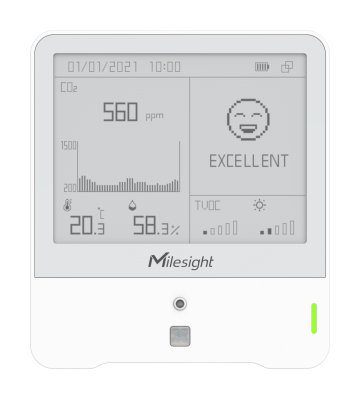

# Ambience Monitoring Sensor - Milesight IoT

The payload decoder function is applicable to AM307(v2).

For more detailed information, please visit [Milesight Official Website](https://www.milesight.com/iot/product/lorawan-sensor/am319).

|        AM307        |
| :-----------------: |
|  |

## Payload Definition

### Attributes

|      CHANNEL       |  ID  | TYPE | LENGTH | DESCRIPTION          |
| :----------------: | :--: | :--: | :----: | -------------------- |
|  Protocol Version  | 0xFF | 0x01 |   1    | protocol_version(1B) |
|    Power Status    | 0xFF | 0x0B |   1    | power_status(1B)     |
|   Serial Number    | 0xFF | 0x16 |   8    | sn(8B)               |
|  Hardware Version  | 0xFF | 0x09 |   2    | hardware_version(2B) |
|  Firmware Version  | 0xFF | 0x0A |   2    | firmware_version(2B) |
| LoRaWAN Class Type | 0xFF | 0x0F |   1    | lorawan_class(1B)    |
|    TSL Version     | 0xFF | 0xFF |   2    | tsl_version(2B)      |

### Telemetry

|     CHANNEL     |  ID  | TYPE | LENGTH | description                                                                                                                                             |
| :-------------: | :--: | :--: | :----: | ------------------------------------------------------------------------------------------------------------------------------------------------------- |
|     Battery     | 0x01 | 0x75 |   1    | battery(1B)<br />battery, unit: %                                                                                                                       |
|   Temperature   | 0x03 | 0x67 |   2    | temperature(2B)<br />temperature, unit: ℃                                                                                                               |
|    Humidity     | 0x04 | 0x68 |   1    | humidity(1B)<br />humidity, unit: %RH                                                                                                                   |
|       PIR       | 0x05 | 0x00 |   1    | pir(1B)                                                                                                                                                 |
|   Light Level   | 0x06 | 0xCB |   1    | light_level(1B)                                                                                                                                         |
|   Illuminance   | 0x06 | 0x94 |   4    | illuminance(4B)<br />illuminance, unit: lux                                                                                                             |
|       CO2       | 0x07 | 0x7D |   2    | co2(2B)<br />co2, unit: ppm                                                                                                                             |
|      tVOC       | 0x08 | 0x7D |   2    | tvoc(2B)<br />tvoc, read: unit16/100                                                                                                                    |
|      tVOC       | 0x08 | 0xE6 |   2    | tvoc(2B)<br />tvoc, unit: ug/m3                                                                                                                         |
|    Pressure     | 0x09 | 0x73 |   2    | pressure(2B)<br />pressure, unit: hPa                                                                                                                   |
|      Beep       | 0x0E | 0x01 |   1    | buzzer_status(1B)                                                                                                                                       |
| Historical Data | 0x20 | 0xCE |   20   | timestamp(4B) + temperature(2B) + humidity(2B) + pir(1B) + light_level(1B) + co2(2B) + tvoc(2B) + pressure(2B) + illuminance(4B)<br />tvoc, iaq         |
| Historical Data | 0x21 | 0xCE |   20   | timestamp(4B) + temperature(2B) + humidity(2B) + pir(1B) + light_level(1B) + co2(2B) + tvoc(2B) + pressure(2B) + illuminance(4B)<br />tvoc, unit: ug/m3 |

## Example

```json
// 0367EE00 04687C 050001 06CB02 077DA803 087D2500 09736627
{
    "temperature": 23.8,
    "humidity": 62,
    "pir": "trigger",
    "light_level": 2,
    "co2": 936,
    "tvoc": 37,
    "pressure": 1008.6
}
```
