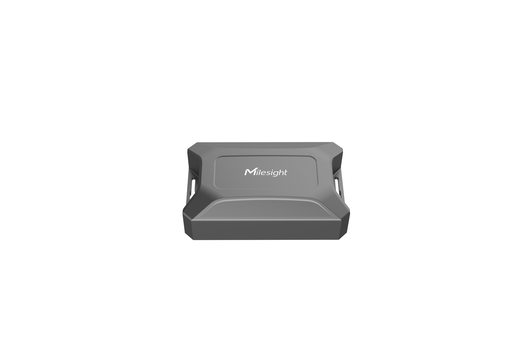

# Outdoor Asset Tracker - Milesight IoT

The payload decoder function is applicable to AT101.

For more detailed information, please visit [Milesight official website](https://www.milesight-iot.com).



## Payload Definition

|       channel        | channel_id | channel_type | data_length (bytes) | description                                      |
| :------------------: | :--------: | :----------: | :-----------------: | ------------------------------------------------ |
|       battery        |    0x01    |     0x75     |          1          | unit: %                                          |
|     temperature      |    0x03    |     0x67     |          2          | unit: ℃                                          |
|       location       |    0x04    |     0x88     |          9          | latitude(4B) + longitude(4B) + motion_status(1B) |
|       position       |    0x05    |     0x00     |          1          | 0: normal<br />1: tilt                           |
|      wifi_scan       |    0x06    |     0xD9     |          9          | ID(1B) + MAC(6B) + RSSI(1B) + motion_status(1B)  |
|    tamper_status     |    0x07    |     0x00     |          1          | 0: install<br />1: uninstall                     |
| temperature_abnormal |    0x83    |     0x67     |          3          | temperature(2B) + status(1B)                     |
|     history data     |    0x20    |     0xCE     |         12          | timestamp(4B) + longitude(4B) + latitude(4B)     |

**motion_status**

|    bits     | 7 - 4                                                                                 | 3 - 0                                                                                      |
| :---------: | :------------------------------------------------------------------------------------ | :----------------------------------------------------------------------------------------- |
| Description | **Geofence Status** <br />0: inside <br />1: outside <br /> 2: unset<br / >3: unknown | **Motion Status** <br />0: unknown<br />1: start moving<br />2: moving<br />3: stop moving |

## Example

```json
// Sample(hex): 01 75 64 03 67 1B 01 05 00 00 04 88 36 BF 77 01 F0 00 09 07 22
{
    "battery": 100,
    "geofence_status": "unset",
    "longitude": 118.030576,
    "latitude": 24.62495,
    "motion_status": "moving",
    "position": "normal",
    "temperature": 28.3
}

// Sample(hex): 01 75 64 03 67 1B 01 05 00 01 06 D9 08 1C C3 16 22 2D F9 C3 02 06 D9 08 24 E1 24 F6 A6 67 B6 02 06 D9 08 24 E1 24 F5 4D E3 BC 02 06 D9 08 24 E1 24 F5 79 71 B2 02 06 D9 08 24 E1 24 F3 19 A8 C8 02
{
    "battery": 100,
    "motion_status": "moving",
    "position": "tilt",
    "temperature": 28.3,
    "wifi": [
        {
            "group": 8,
            "mac": "1c:c3:16:22:2d:f9",
            "rssi": -61
        },
        {
            "group": 8,
            "mac": "24:e1:24:f6:a6:67",
            "rssi": -74
        },
        {
            "group": 8,
            "mac": "24:e1:24:f5:4d:e3",
            "rssi": -68
        },
        {
            "group": 8,
            "mac": "24:e1:24:f5:79:71",
            "rssi": -78
        },
        {
            "group": 8,
            "mac": "24:e1:24:f3:19:a8",
            "rssi": -56
        }
    ]
}
```
