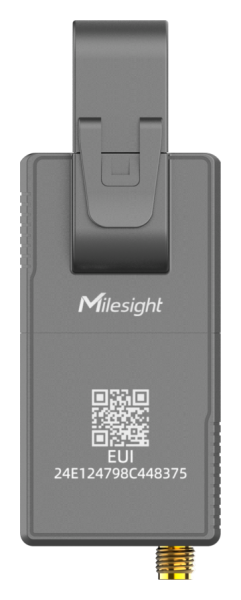

# Smart Current Transformer - Milesight IoT

The payload decoder function is applicable to CT101 / CT103.

For more detailed information, please visit [milesight official website](https://www.milesight-iot.com).



## Payload Definition

|      CHANNEL      |  ID  | TYPE | LENGTH | DESCRIPTION                                                                                                                                                                        |
| :---------------: | :--: | :--: | :----: | ---------------------------------------------------------------------------------------------------------------------------------------------------------------------------------- |
| Protocol Version  | 0xFF | 0x01 |   1    | protocol_version(1B)                                                                                                                                                               |
|   Power Status    | 0xFF | 0x0B |   1    | power(1B)                                                                                                                                                                          |
|   Serial Number   | 0xFF | 0x16 |   8    | sn(8B)                                                                                                                                                                             |
| Hardware Version  | 0xFF | 0x09 |   2    | hardware_version(8B)                                                                                                                                                               |
| Firmware Version  | 0xFF | 0x0A |   2    | firmware_version(8B)                                                                                                                                                               |
|   Total Current   | 0x03 | 0x97 |   4    | total_ah(4B)<br />total_ah, read: uint32/100, unit: Ah                                                                                                                             |
|      Current      | 0x04 | 0x98 |   2    | current(2B)<br />current, read: uint16/100, unit: A                                                                                                                                |
|    Temperature    | 0x09 | 0x67 |   2    | temperature(2B)<br />temperature, read: int16/10, unit: ℃ ｜                                                                                                                       |
|   Current Alarm   | 0x84 | 0x98 |   7    | current_max(2B) + current_min(2B) + current(2B) + alarm(1B)<br />alarm, values: (0: threshold alarm, 1: threshold alarm release, 2: over range alarm, 3: over range alarm release) |
| Temperature Alarm | 0x89 | 0x67 |   3    | temperature(2B) + temperature_alarm(1B)<br />temperature, read: int16/10, unit: ℃<br />temperature_alarm, values: (0: threshold alarm release, 1: threshold alarm)                 |

## Example

```json
// FF0BFF FF0101 FF166746D38802580000 FF090100 FF0A0101 FF0F00
{
    "firmware_version": "v1.1",
    "hardware_version": "v1.0",
    "ipso_version": "v0.1",
    "power": "on",
    "sn": "6746d38802580000"
}

// 039710270000
{
    "total_current": 100
}

// 0498B80B00000000
{
    "current": 30
}

// 0498FFFF
{
    "alarm": "read failed"
}

// 8498B80BD007C40905
{
    "alarm": [
        "threshold alarm",
        "over range alarm"
    ],
    "current": 25,
    "current_max": 30,
    "current_min": 20
}
```
