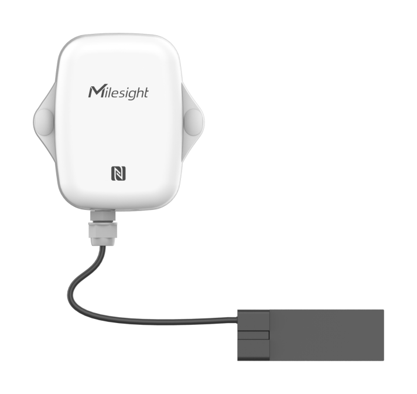

# Capacitive Level Sensor - Milesight IoT

The payload decoder function is applicable to EM300-CL.

For more detailed information, please visit [milesight official website](https://www.milesight-iot.com).



## Payload Definition

|     CHANNEL      |  ID  | TYPE | LENGTH | DESCRIPTION                                                                                                                                                                                             |
| :--------------: | :--: | :--: | :----: | ------------------------------------------------------------------------------------------------------------------------------------------------------------------------------------------------------- |
|     Battery      | 0x01 | 0x75 |   1    | battery(1B)<br/>battery, unit: %                                                                                                                                                                        |
|  Liquid Status   | 0x03 | 0xED |   1    | liquid(1B)<br/>liquid, values: (0: uncalibrated, 1: full, 2: critical liquid level alert, 0xff: error)                                                                                                  |
| Calibrate Result | 0x04 | 0xEE |   1    | calibrate_result(1B)<br/>calibrate_result, values: (0: failed, 1: success)                                                                                                                              |
|   Liquid Alarm   | 0x83 | 0xED |   2    | liquid(1B) + alarm(1B)<br/>liquid, values: (0: uncalibrated, 1: full, 2: critical liquid level alert, 0xff: error)<br/>alarm: (0: critical liquid level alarm release, 1: critical liquid level alarm ) |

## Example

```json
// 017564 03ED00
{
    "battery": 100,
    "liquid": "uncalibrated"
}

// 03ED01
{
    "liquid": "full"
}

// 03ED02
{
    "liquid": "critical liquid level alert"
}

// 03EDFF
{
    "liquid": "error"
}

// 83ED0100
{
    "liquid": "full",
    "liquid_alarm": "critical liquid level alarm release"
}

// 83ED0201
{
    "liquid": "critical liquid level alert",
    "liquid_alarm": "critical liquid level alarm"
}

// 04EE01
{
    "calibration_result": "success"
}

// 04EE00
{
    "calibration_result": "failed"
}
```
