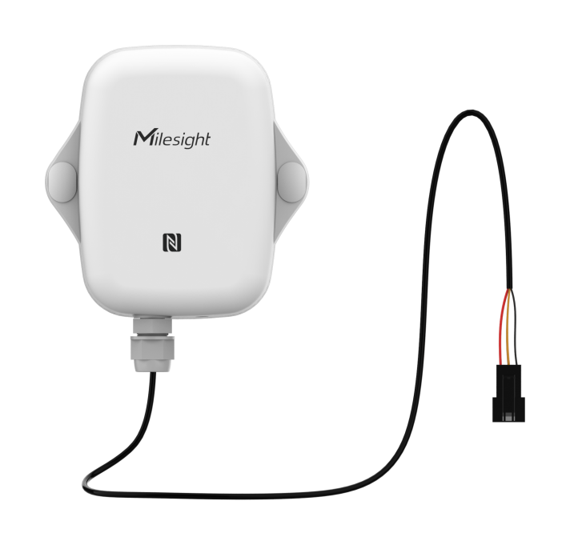

# Pulse Counter with Hall - Milesight IoT

The payload decoder function is applicable to EM300-DI.

For more detailed information, please visit [milesight official website](https://www.milesight-iot.com).



## Payload Definition

|     CHANNEL     |  ID  | TYPE | LENGTH | DESCRIPTION                                                                                                                                                                                                                                                                                                                                                                                                                          |
| :-------------: | :--: | :--: | :----: | ------------------------------------------------------------------------------------------------------------------------------------------------------------------------------------------------------------------------------------------------------------------------------------------------------------------------------------------------------------------------------------------------------------------------------------ |
|     Battery     | 0x01 | 0x75 |   1    | **battery(1B)**<br/>[battery] unit: %                                                                                                                                                                                                                                                                                                                                                                                                |
|   Temperature   | 0x03 | 0x67 |   2    | **temperature(2B)**<br/>[temperature] unit: °C                                                                                                                                                                                                                                                                                                                                                                                       |
|    Humidity     | 0x04 | 0x68 |   1    | **humidity(1B)**<br/>[humidity] unit: %                                                                                                                                                                                                                                                                                                                                                                                              |
|      GPIO       | 0x05 | 0x00 |   1    | **gpio(1B)**                                                                                                                                                                                                                                                                                                                                                                                                                         |
|      Water      | 0x06 | 0xE1 |   8    | **water_conv(2b) + pulse_conv(2B) + water(4B)**<br/>water_conv/pulse_conv \* counter = water                                                                                                                                                                                                                                                                                                                                         |
|   GPIO Alarm    | 0x85 | 0x00 |   1    | **gpio(1B) + gpio_alarm(1B)**<br/>[gpio] values: (0: low, 1: high)<br/>[gpio_alarm] values:(1: gpio alarm, 0: gpio alarm release)                                                                                                                                                                                                                                                                                                    |
|   Water Alarm   | 0x86 | 0xE1 |   9    | **water_conv(2b) + pulse_conv(2B) + water(4B) + water_alarm(1B)**<br/>[water_alarm] (1: water outage timeout alarm, 2: water outage timeout alarm release, 3: water flow timeout alarm, 4: water flow timeout alarm release)                                                                                                                                                                                                         |
| Historical Data | 0x21 | 0xCE |   18   | **timestamp(4B) + temperature(2B) + humidity(1B) + alarm(1B) + gpio_type(1B) + gpio(1B) + water_conv(2B) + pulse_conv(2B) + water(4B)**<br/>[gpio_type] values: (1: gpio, 2: pulse)<br/>[gpio] values: (0: low, 1: high)<br/>[alarm] values: (0: none, 1: water outage timeout alarm, 2: water outage timeout alarm release, 3: water flow timeout alarm, 4: water flow timeout alarm release, 5: gpio alarm, 6: gpio alarm release) |

## Example

```json
// 017564 06E10A000A0000000000
{
    "battery": 100,
    "water_conv": 1,
    "pluse_conv": 1,
    "water": 0
}

// 86E16400A0000040394401
{
    "water_conv": 10,
    "pluse_conv": 16,
    "water": 741,
    "water_alarm": "water outage timeout alarm"
}

// 86E10A0088023393BB4403
{
    "water_conv": 1,
    "pluse_conv": 64.8,
    "water": "1500.60",
    "water_alarm": "water flow timeout alarm"
}

// 21CEDFF40B650000000102010A000A000080EC44
{
    "history": [
        {
            "timestamp": 1695282399,
            "water_conv": 1,
            "pluse_conv": 1,
            "water": "1892.00",
            "alarm": "water outage timeout alarm"
        }
    ]
}
```
