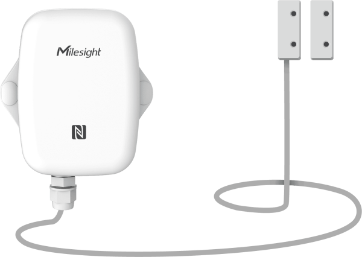

# Magnetic Contact Switch - Milesight IoT

The payload decoder function is applicable to EM300-MCS.

For more detailed information, please visit [milesight official website](https://www.milesight-iot.com).



## Payload Definition

|     channel     | channel_id | channel_type | data_length (bytes) | description                                                        |
| :-------------: | :--------: | :----------: | :-----------------: | ------------------------------------------------------------------ |
|     battery     |    0x01    |     0x75     |          1          | unit: %                                                            |
|   temperature   |    0x03    |     0x67     |          2          | unit: ℃                                                            |
|    humidity     |    0x04    |     0x68     |          1          | unit: %RH                                                          |
|  magnet status  |    0x06    |     0x00     |          1          | 0: close, 1: open                                                  |
| historical data |    0x20    |     0XCE     |          8          | timestamp(4B) + temperature(2B) + humidity(1B) + magnet_status(1B) |

## Example

```json
// Sample(hex): 01 75 5C 03 67 34 01 04 68 65 06 00 01
{
    "battery": 92,
    "temperature": 30.8,
    "humidity": 50.5,
    "magnet_status": "open"
}

// Sample(hex): 20 CE 9E 74 46 63 10 01 5D 01
{
  "history": [
    {
      "magnet_status": "open",
      "humidity": 46.5,
      "temperature": 27.2,
      "timestamp": 1665561758
    }
  ]
}
```
