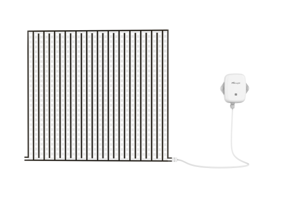

# Membrane Leak Detection Sensor - Milesight IoT

The payload decoder function is applicable to EM300-MLD.

For more detailed information, please visit [milesight official website](https://www.milesight-iot.com).



## Payload Definition

|     CHANNEL     |  ID  | TYPE | LENGTH | DESCRIPTION                                                         |
| :-------------: | :--: | :--: | :----: | ------------------------------------------------------------------- |
|     Battery     | 0x01 | 0x75 |   1    | battery(1B)<br/>battery, unit: %                                    |
| Leakage Status  | 0x06 | 0x00 |   1    | leakage_status(1B)<br/>leakage_status, values:(0: normal, 1: leak)  |
| Historical Data | 0x20 | 0XCE |   8    | timestamp(4B) + temperature(2B) + humidity(1B) + leakage_status(1B) |

## Example

```json
// 01755C 050000
{
  "battery": 92,
  "leakage_status": "normal"
}

// 20CE9E74466300000001
{
  "history": [
    {
      "leakage_status": "leak",
      "timestamp": 1665561758
    }
  ]
}
```
