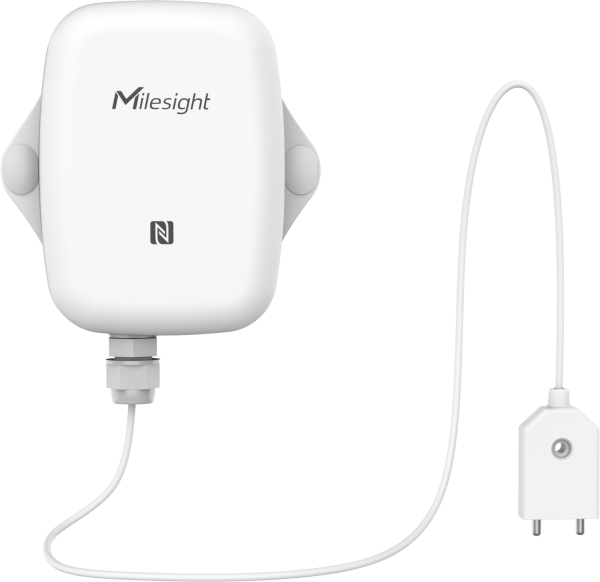
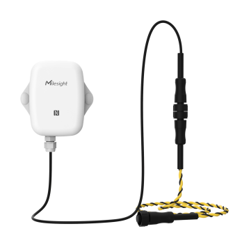

# Spot Leak Detection Sensor / Zone Leak Detection Sensor - Milesight IoT

The payload decoder function is applicable to EM300-SLD and EM300-ZLD.

For more detailed information, please visit [milesight official website](https://www.milesight-iot.com).

|          EM300-SLD          |          EM300-ZLD          |
| :-------------------------: | :-------------------------: |
|  |  |

## Payload Definition

|     channel     | channel_id | channel_type | data_length (bytes) | description                                                             |
| :-------------: | :--------: | :----------: | :-----------------: | ----------------------------------------------------------------------- |
|     Battery     |    0x01    |     0x75     |          1          | **battery(1B)**, unit: %                                                |
|   Temperature   |    0x03    |     0x67     |          2          | **temperature(2B)**, unit: ℃                                            |
|    Humidity     |    0x04    |     0x68     |          1          | **humidity(1B)**, unit: %RH                                             |
| Leakage Status  |    0x05    |     0x00     |          1          | **leakage_status(1B)**<br/><br/>leakage_status: (0: normal, 1: leak)    |
| Historical Data |    0x20    |     0XCE     |          8          | **timestamp(4B) + temperature(2B) + humidity(1B) + leakage_status(1B)** |

## Example

```json
// 01755C 03673401 046865 050000
{
  "battery": 92,
  "temperature": 30.8,
  "humidity": 50.5,
  "leakage_status": "normal"
}

// 20CE9E74466310015D01
{
  "history": [
    {
      "temperature": 27.2,
      "humidity": 46.5,
      "leakage_status": "leak",
      "timestamp": 1665561758
    }
  ]
}
```
