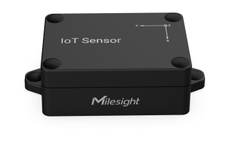

# Tilt Sensor - Milesight IoT

The payload decoder function is applicable to EM310-TILT.

For more detailed information, please visit [milesight official website](https://www.milesight-iot.com).



## Payload Definition

|   CHANNEL   |  ID  | TYPE | LENGTH | DESCRIPTION                                                                                                                                                                                                                                                                               |
| :---------: | :--: | :--: | :----: | ----------------------------------------------------------------------------------------------------------------------------------------------------------------------------------------------------------------------------------------------------------------------------------------- |
|   Battery   | 0x01 | 0x75 |   1    | battery(1B)<br/>battery, unit: %                                                                                                                                                                                                                                                          |
| Angle X/Y/Z | 0x03 | 0xCF |   7    | angle_x(2B) + angle_y(2B) + angle_z(2B) + status(1B)<br/>angle_x, read: int16/100, unit: °<br/>angle_y, read: int16/100, unit: °<br/>angle_z, read: int16/100, unit: ° <br/>status, values: (bit0: angle_x threshold alarm, bit1: angle_y threshold alarm, bit2: angle_z threshold alarm) |

## Example

```json
// 03CF00000000282307
{
    "angle_x": 0,
    "angle_y": 0,
    "angle_z": 90,
    "threshold_x": "trigger",
    "threshold_y": "trigger",
    "threshold_z": "trigger"
}
```
