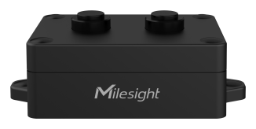

# Ultrasonic Distance/Level Sensor - Milesight IoT

The payload decoder function is applicable to EM310-UDL.

For more detailed information, please visit [milesight official website](https://www.milesight-iot.com).



## Payload Definition

| CHANNEL  |  ID  | TYPE | LENGTH | DESCRIPTION                                             |
| :------: | :--: | :--: | :----: | ------------------------------------------------------- |
| Battery  | 0x01 | 0x75 |   1    | battery(1B)<br/>battery, unit: %                        |
| Distance | 0x03 | 0x82 |   2    | distance(2B)<br/>distance, unit: mm                     |
| Position | 0x04 | 0x00 |   1    | position(1B)<br/>position, values: (0: normal, 1: tilt) |

## Example

```json
// 01755C 03824408 040001
{
    "battery": 92,
    "distance": 2116,
    "position": "tilt"
}
```
