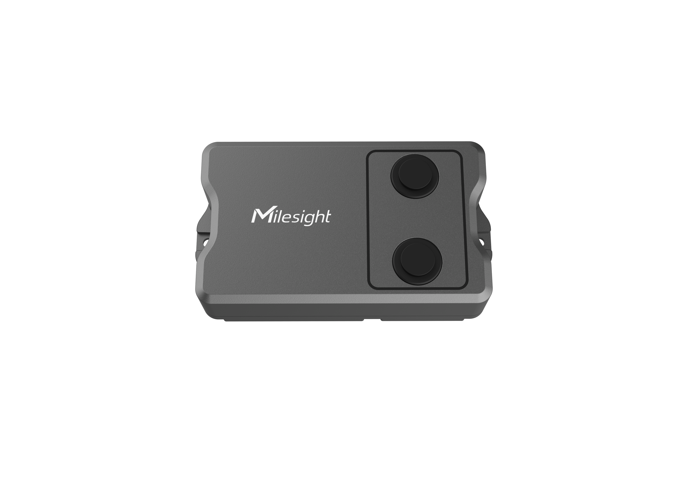

# Multifunctional Ultrasonic Distance/Level Sensor - Milesight IoT


The payload decoder function is applicable to EM400-MUD. 

For more detailed information, please visit [milesight official website](https://www.milesight-iot.com).


## Payload Definition

 ```
--------------------- Payload Definition ---------------------

                    [channel_id] [channel_type] [channel_value]
 01: battery      -> 0x01         0x75          [1byte ] Unit: %
 03: temperature  -> 0x03         0x67          [2bytes] Unit: °C (°F)
 04: distance     -> 0x04         0x82          [2bytes] Unit: mm
 05: position     -> 0x05         0x00          [1byte ] Unit: 
 ------------------------------------------ EM400-MUD
 ```

## Example for The Things Network

**Payload**
```
01 75 5C 03 67 01 01 04 82 44 08 05 00 01
```

```
83 67 e8 00 01 84 82 41 06 01
```

**Data Segmentation**

   - `01 75 5C`
   - `03 67 01 01`
   - `04 82 44 08`
   - `05 00 01`
   - `83 67 e8 00 01`
   - `84 82 41 06 01`


**Output**

 ```json
{
  "battery": 92,
  "temperature": 25.7,
  "distance": 2116,
  "position": "tilt"
}
 ```

 temperature abnormal
 ```json
{
  "temperature": 23.2,
  "temperature_abnormal": true
}
```

distance alarming
```json
{
  "distance": 1601,
  "distance_alarming": true,
}
```