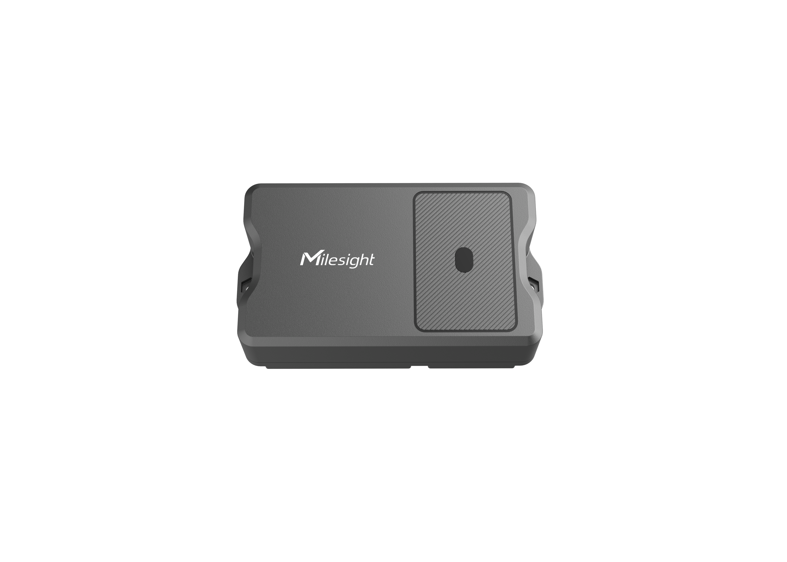

# ToF Laser Distance Sensor - Milesight IoT

The payload decoder function is applicable to EM400-TLD.

For more detailed information, please visit [milesight official website](https://www.milesight-iot.com).



## Payload Definition

|         channel         | channel_id | channel_type | data_length (bytes) | description                                      |
| :---------------------: | :--------: | :----------: | :-----------------: | ------------------------------------------------ |
|         battery         |    0x01    |     0x75     |          1          | unit: %                                          |
|       temperature       |    0x03    |     0x67     |          2          | unit: ℃                                          |
|        distance         |    0x04    |     0x82     |          2          | unit: mm                                         |
|        position         |    0x05    |     0x00     |          1          | 0: normal<br />1: tilt                           |
| location <br />(NB-IoT) |    0x06    |     0x88     |          9          | latitude(4B) + longitude(4B) + motion_status(1B) |
|  temperature abnormal   |    0x83    |     0x67     |          3          | temperature(2B) + status(1B)                     |
|    distance alarming    |    0x84    |     0x82     |          3          | distance(2B) + status(1B)                        |

**motion_status**

|    BITS     | 7 - 4                                                                              | 3 - 0                                                                                      |
| :---------: | :--------------------------------------------------------------------------------- | :----------------------------------------------------------------------------------------- |
| DESCRIPTION | **Geofence Status** <br />0: inside <br />1: outside <br />2: unset<br/>3: unknown | **Motion Status** <br />0: unknown<br />1: start moving<br />2: moving<br />3: stop moving |

## Example (Sensor Payload Data)

```json
// Sample(hex): 01 75 5C 03 67 01 01 04 82 44 08 05 00 01
{
  "battery": 92,
  "temperature": 25.7,
  "distance": 2116,
  "position": "tilt"
}

// Sample(hex): 83 67 e8 00 01 84 82 41 06 01
{
  "temperature": 23.2,
  "temperature_abnormal": true,
  "distance": 1601,
  "distance_alarming": true
}

// Sample(hex): 06 88 36 bf 77 01 f0 00 09 07 22
{
  "longitude": 24.62495,
  "latitude": 118.030576,
  "motion_status": "moving",
  "geofence_status": "unset"
}
```

## Example (NB-IoT Package Data)

|        | START FLAG |  ID  | DATA LENGTH | FLAG | FRAME COUNT | PROTOCOL VERSION | FIRMWARE VERSION | HARDWARE VERSION |          SERIAL NUMBER           |              IMEI              |              IMSI              |                  ICCID                   | CSQ | SENSOR PAYLOAD LENGTH |                          SENSOR PAYLOAD DATA                          |
| :----: | :--------: | :--: | :---------: | :--: | :---------: | :--------------: | :--------------: | :--------------: | :------------------------------: | :----------------------------: | :----------------------------: | :--------------------------------------: | :-: | :-------------------: | :-------------------------------------------------------------------: |
|        |     1B     |  2B  |     2B      |  1B  |     2B      |        1B        |        4B        |        4B        |               16B                |              15B               |              15B               |                   20B                    | 1B  |          2B           |                                  NB                                   |
| sample |     02     | 0001 |    005f     |  00  |    0000     |        01        |     30313031     |     30313130     | 36373439443139303534363930303331 | 383638353038303634383037333530 | 343630303433323234323133313130 | 3839383630343132313032323730303632383537 | 09  |         000e          |                     01756403670b0104823b01050001                      |
| result |     2      |  1   |     95      |  0   |      0      |        1         |       0101       |       0110       |         6749D19054690031         |        868508064807350         |        460043224213110         |           89860412102270062857           |  9  |          14           | `{ battery: 100, temperature: 26.7, distance: 315, position: 'tilt' }` |

```json
{
    "startFlag": 2,
    "id": 1,
    "length": 95,
    "flag": 0,
    "frameCnt": 0,
    "protocaolVersion": 1,
    "softwareVersion": "0101",
    "hardwareVersion": "0110",
    "sn": "6749D19054690031",
    "imei": "868508064807350",
    "imsi": "460043224213110",
    "iccid": "89860412102270062857",
    "csq": 9,
    "data_length": 14,
    "data": [{ "battery": 100, "temperature": 26.7, "distance": 315, "position": "tilt" }]
}
```
