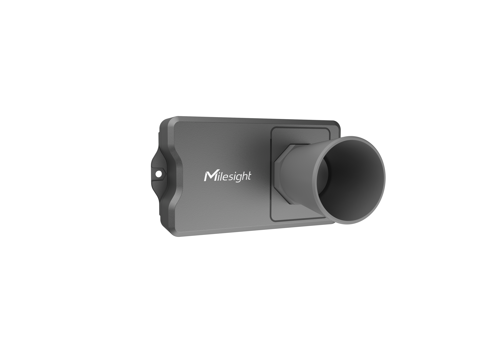

# Ultrasonic Distance/ Level Sensor - Milesight IoT

The payload decoder function is applicable to EM400-UDL.

For more detailed information, please visit [milesight official website](https://www.milesight-iot.com).



## Payload Definition

|        CHANNEL        |  ID  | TYPE | LENGTH | DESCRIPTION                                             |
| :-------------------: | :--: | :--: | :----: | ------------------------------------------------------- |
|        Battery        | 0x01 | 0x75 |   1    | battery(1B)<br/>battery, unit: %                        |
|      Temperature      | 0x03 | 0x67 |   2    | temperature(2B)<br/>temperature, unit: ℃                |
|       Distance        | 0x04 | 0x82 |   2    | distance(2B)<br/>distance, unit: mm                     |
|       Position        | 0x05 | 0x00 |   1    | position(1B)<br/>position, values: (0: normal, 1: tilt) |
| Location<br/>(NB-IoT) | 0x06 | 0x88 |   9    | longitude(4B) + latitude(4B) + motion_status(1B)        |
| Temperature Abnormal  | 0x83 | 0x67 |   3    | temperature(2B) + status(1B)                            |
|    Distance Alarm     | 0x84 | 0x82 |   3    | distance(2B) + status(1B)                               |

### Motion Status Definition

|    BITS     | 7..4                                                                  | 3..0                                                                           |
| :---------: | :-------------------------------------------------------------------- | :----------------------------------------------------------------------------- |
| DESCRIPTION | geofence_status, values:(0: inside, 1: outside, 2: unset, 3: unknown) | motion_status, values:(0: unknown, 1: start moving, 2: moving, 3: stop moving) |

## Example (Sensor Payload Data)

```json
// 01755C 03670101 04824408 050001
{
  "battery": 92,
  "temperature": 25.7,
  "distance": 2116,
  "position": "tilt"
}

// 8367e80001 8482410601
{
  "temperature": 23.2,
  "temperature_abnormal": true,
  "distance": 1601,
  "distance_alarming": true
}

// 068836bf7701f000090722
{
  "longitude": 24.62495,
  "latitude": 118.030576,
  "motion_status": "moving",
  "geofence_status": "unset"
}
```

## NB-IoT Data Frame

|        | START FLAG |  ID  | DATA LENGTH | FLAG | FRAME COUNT | PROTOCOL VERSION | FIRMWARE VERSION | HARDWARE VERSION |          SERIAL NUMBER           |              IMEI              |              IMSI              |                  ICCID                   | CSQ | SENSOR PAYLOAD LENGTH |                          SENSOR PAYLOAD DATA                           |
| :----: | :--------: | :--: | :---------: | :--: | :---------: | :--------------: | :--------------: | :--------------: | :------------------------------: | :----------------------------: | :----------------------------: | :--------------------------------------: | :-: | :-------------------: | :--------------------------------------------------------------------: |
|        |     1B     |  2B  |     2B      |  1B  |     2B      |        1B        |        4B        |        4B        |               16B                |              15B               |              15B               |                   20B                    | 1B  |          2B           |                                   NB                                   |
| sample |     02     | 0001 |    005f     |  00  |    0000     |        01        |     30313031     |     30313130     | 36373439443139303534363930303331 | 383638353038303634383037333530 | 343630303433323234323133313130 | 3839383630343132313032323730303632383537 | 09  |         000e          |                      01756403670b0104823b01050001                      |
| result |     2      |  1   |     95      |  0   |      0      |        1         |       0101       |       0110       |         6749D19054690031         |        868508064807350         |        460043224213110         |           89860412102270062857           |  9  |          14           | `{ battery: 100, temperature: 26.7, distance: 315, position: 'tilt' }` |

## Example (NB-IoT)

```json
{
    "startFlag": 2,
    "id": 1,
    "length": 95,
    "flag": 0,
    "frameCnt": 0,
    "protocaolVersion": 1,
    "softwareVersion": "0101",
    "hardwareVersion": "0110",
    "sn": "6749D19054690031",
    "imei": "868508064807350",
    "imsi": "460043224213110",
    "iccid": "89860412102270062857",
    "csq": 9,
    "data_length": 14,
    "data": [{ "battery": 100, "temperature": 26.7, "distance": 315, "position": "tilt" }]
}
```
