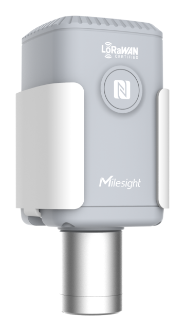

# CO2 Sensor - Milesight IoT

The payload decoder function is applicable to EM500-CO2.

For more detailed information, please visit [milesight official website](https://www.milesight-iot.com).



## Payload Definition

|     channel     | channel_id | channel_type | data_length (bytes) | description                                                             |
| :-------------: | :--------: | :----------: | :-----------------: | ----------------------------------------------------------------------- |
|     battery     |    0x01    |     0x75     |          1          | unit: %                                                                 |
|   temperature   |    0x03    |     0x67     |          2          | unit: ℃                                                                 |
|    humidity     |    0x04    |     0x68     |          1          | unit: %RH                                                               |
|       co2       |    0x05    |     0x7D     |          2          | unit: ppm                                                               |
|    pressure     |    0x06    |     0x73     |          2          | unit: hPa                                                               |
| historical data |    0x20    |     0XCE     |         11          | timestamp(4B) + co2(2B) + pressure(2B) + temperature(2B) + humidity(1B) |

## Example

```json
// Sample(hex): 01 75 64 03 67 19 01 04 68 73 05 7D 67 04 06 73 68 27
{
    "battery": 100,
    "temperature": 28.1,
    "humidity": 57.5,
    "co2": 1127,
    "pressure": 1008.8
}
```
