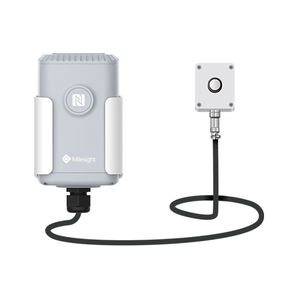

# Light Sensor - Milesight IoT

The payload decoder function is applicable to EM500-LGT.

For more detailed information, please visit [milesight official website](https://www.milesight-iot.com).



## Payload Definition

|     CHANNEL     |  ID  | TYPE | LENGTH | DESCRIPTION                                  |
| :-------------: | :--: | :--: | :----: | -------------------------------------------- |
|     Battery     | 0x01 | 0x75 |   1    | battery(1B)<br/>battery, unit: %             |
|  Illumination   | 0x03 | 0x94 |   4    | illumination(4B)<br/>illumination, unit: lux |
| Historical Data | 0x20 | 0XCE |   8    | timestamp(4B) + illumination(4B)             |

## Example

```json
// 017564 039450000000
{
    "battery": 100,
    "illumination": 80
}
```
