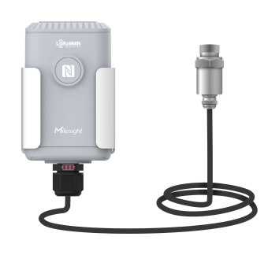

# Pipe Pressure Sensor - Milesight IoT

The payload decoder function is applicable to EM500-PP.

For more detailed information, please visit [milesight official website](https://www.milesight-iot.com).



## Payload Definition

```
--------------------- Payload Definition ---------------------

                   [channel_id] [channel_type] [channel_value]
01: battery      -> 0x01         0x75          [1byte ] Unit: %
03: pressure     -> 0x03         0x7B          [2bytes] Unit: kPa
------------------------------------------ EM500-PP
```

## Example for The Things Network

**Payload**

```
01 75 64 03 7B 0A 00
```

**Data Segmentation**

-   `01 75 64`
-   `03 7B 0A 00`

**Output**

```json
{
    "battery": 100,
    "pressure": 10
}
```
