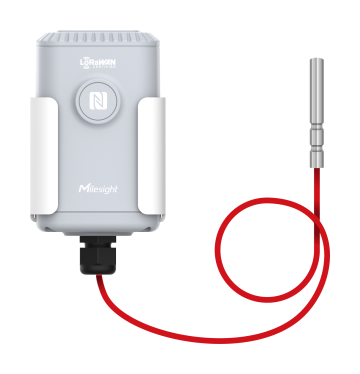

# Industrial Temperature Sensor - Milesight IoT

The payload decoder function is applicable to EM500-PT100.

For more detailed information, please visit [milesight official website](https://www.milesight-iot.com).



## Payload Definition

|     CHANNEL     |  ID  | TYPE | LENGTH | DESCRIPTION                              |
| :-------------: | :--: | :--: | :----: | ---------------------------------------- |
|     Battery     | 0x01 | 0x75 |   1    | battery(1B)<br/>battery, unit: %         |
|   Temperature   | 0x03 | 0x67 |   2    | temperature(2B)<br/>temperature, unit: ℃ |
| Historical Data | 0x20 | 0XCE |   6    | timestamp(4B) + temperature(2B)          |

## Example

```json
// 017564 03671901
{
    "battery": 100,
    "temperature": 28.1
}
```
