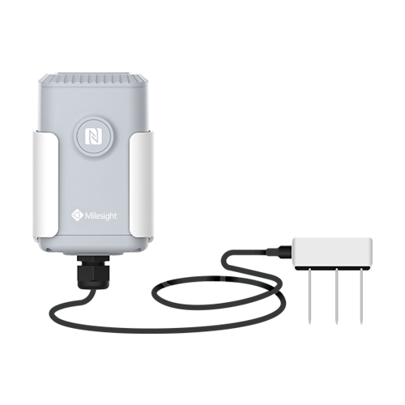

# Soil Moisture, Temperature and Electrical Conductivity Sensor - Milesight IoT

The payload decoder function is applicable to EM500-SMTC.

For more detailed information, please visit [milesight official website](https://www.milesight-iot.com).



## Payload Definition

|      CHANNEL      |  ID  | TYPE | LENGTH | DESCRIPTION                                                                               |
| :---------------: | :--: | :--: | :----: | ----------------------------------------------------------------------------------------- |
|      Battery      | 0x01 | 0x75 |   1    | battery(1B)<br/>battery, unit: %                                                          |
|    Temperature    | 0x03 | 0x67 |   2    | temperature(2B)<br/>temperature, unit: ℃                                                  |
|     Moisture      | 0x04 | 0x68 |   1    | moisture(1B)<br/>moisture, unit: %RH                                                      |
|     Moisture      | 0x04 | 0xCA |   2    | moisture(2B)<br/>moisture, unit: %RH                                                      |
|        EC         | 0x05 | 0x7F |   2    | ec(2B)<br/>ec, unit: µs/cm                                                                |
| Temperature Alarm | 0x83 | 0xD7 |   5    | temperature(2B) + temperature_change(2B) + temperature_alarm(1B)<br/>temperature, unit: ℃ |
|  Historical Data  | 0x20 | 0XCE |   10   | timestamp(4B) + EC(2B) + temperature(2B) + moisture(2B)                                   |

## Example

```json
// 017564 03671901 046873 057FF000
{
    "battery": 100,
    "temperature": 28.1,
    "moisture": 57.5,
    "ec": 240
}
```
