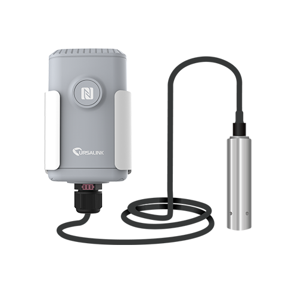

# Submersible Water Level Sensor - Milesight IoT

The payload decoder function is applicable to EM500-SWL.

For more detailed information, please visit [milesight official website](https://www.milesight-iot.com).



## Payload Definition

|     channel     | channel_id | channel_type | data_length (bytes) | description                     |
| :-------------: | :--------: | :----------: | :-----------------: | ------------------------------- |
|     battery     |    0x01    |     0x75     |          1          | unit: %                         |
|   water_level   |    0x03    |     0x77     |          2          | unit: cm                        |
| historical data |    0x20    |     0XCE     |          6          | timestamp(4B) + water_level(2B) |

## Example

```json
// Sample(hex): 01 75 64 03 77 02 00
{
    "battery": 100,
    "water_level": 2
}
```
