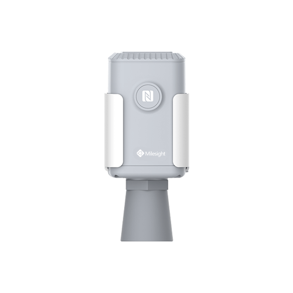

# Ultrasonic Distance/Level Sensor - Milesight IoT

The payload decoder function is applicable to EM500-UDL.

For more detailed information, please visit [milesight official website](https://www.milesight-iot.com).



## Payload Definition

|     CHANNEL     |  ID  | TYPE | LENGTH | DESCRIPTION                         |
| :-------------: | :--: | :--: | :----: | ----------------------------------- |
|     Battery     | 0x01 | 0x75 |   1    | battery(1B)<br/>battery, unit: %    |
|    Distance     | 0x03 | 0x82 |   2    | distance(2B)<br/>distance, unit: mm |
| Historical Data | 0x20 | 0XCE |   6    | timestamp(4B) + distance(2B)        |

## Example

```json
// 017564 03821E00
{
    "battery": 100,
    "distance": 30
}
```
