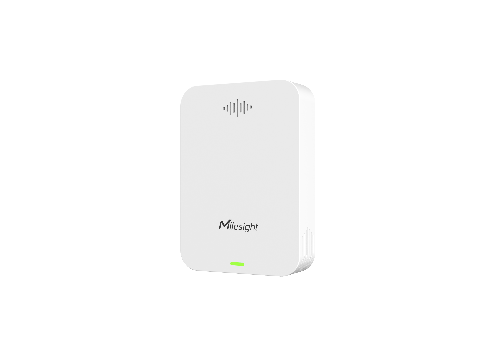

# Bathroom Odor Detector - Milesight IoT

The payload decoder function is applicable to GS301.

For more detailed information, please visit [milesight official website](https://www.milesight-iot.com).



## Payload Definition

|   CHANNEL   |  ID  | TYPE | LENGTH | DESCRIPTION                              |
| :---------: | :--: | :--: | :----: | ---------------------------------------- |
|   Battery   | 0x01 | 0x75 |   1    | battery(1B)<br/>battery, unit: %         |
| Temperature | 0x02 | 0x67 |   2    | temperature(2B)<br/>temperature, unit: ℃ |
|  Humidity   | 0x03 | 0x68 |   1    | humidity(1B)<br/>humidity, unit: %RH     |
|    TVOC     | 0x18 | 0x7D |   2    | tvoc(2B)<br/>tvoc, unit: ppm             |
|     NOX     | 0x37 | 0x7D |   2    | nox(2B)<br/>nox, unit: ppm               |

## Example

```json
// 017564 02671C01 036864
{
    "battery": 100,
    "temperature": 28.4,
    "humidity": 50
}
```
