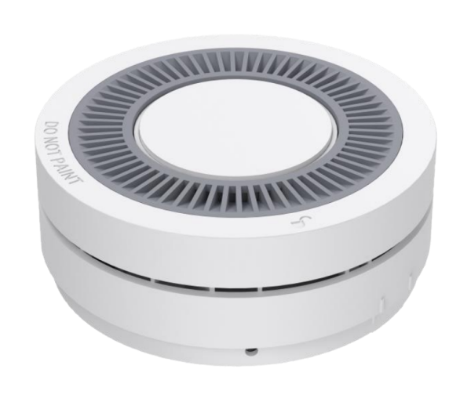

# Smoke Detection Sensor - Milesight IoT

The payload decoder function is applicable to GS524N.

For more detailed information, please visit [Milesight official website](https://www.milesight.cn).



## Payload Definition

| BYTES | DESCRIPTION                                                                                                                                                                                                                                                                                |
| :---: | :----------------------------------------------------------------------------------------------------------------------------------------------------------------------------------------------------------------------------------------------------------------------------------------- |
|   1   | protocol_version(0..3) + firmware_version(4..7)<br/>firmware_version, range: [1, 15]<rb>, current version: 2<br/>protocol_version, range: [1, 15], current version: 2                                                                                                                      |
|   2   | message_type(0..3) + sensor_type(4..7)<br/>message_type, values: (1: alarm, 2: silent, 4: low battery, 5: failover, 7: normal, 10: removed, 11: installed, 14: testing alarm with normal battery, 15: testing alarm with low battery)<br/>sensor_type, values: (1: smoke detection sensor) |
|   3   | battery(1B)<br/>battery, uint: %                                                                                                                                                                                                                                                           |
|   4   | concentration(1B)<br/>concentration, uint: %                                                                                                                                                                                                                                               |
|   5   | temperature(1B)<br/>temperature, range: [-20, 70], uint: ℃                                                                                                                                                                                                                                 |
|   6   | crc(1B)<br/>crc, calc: byte1 + byte2 + byte3 + byte4 + byte5 + byte6 = 0x00                                                                                                                                                                                                                |

# Sample

```json
// 221E64001C40
{
    "version": 2,
    "protocol": 2,
    "type": "smoke sensor",
    "battery": 100,
    "concentration": 0,
    "temperature": 28,
    "event": "testing alarm with normal battery"
}
```
