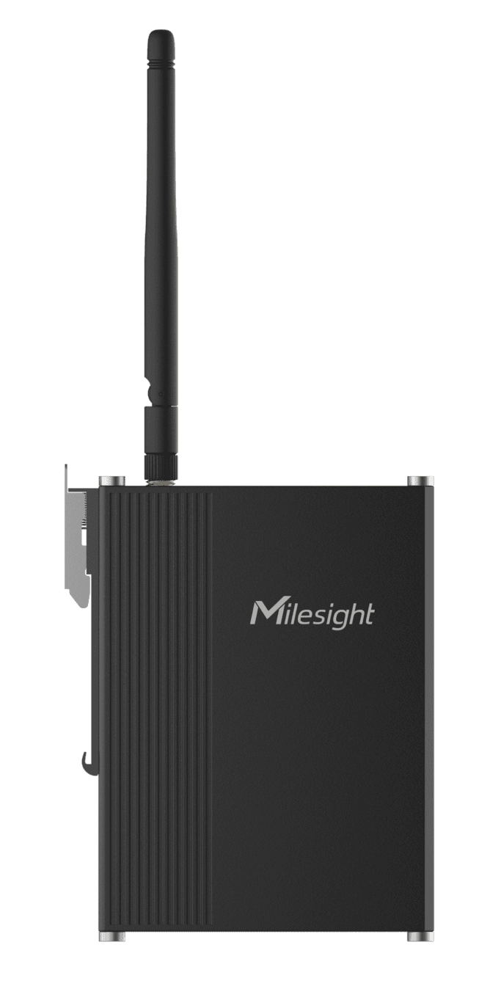

# IoT Controller - Milesight IoT

For more detailed information, please visit [milesight official website](https://www.milesight-iot.com).

The payload decoder function is applicable to UC300.



## Payload Definition

|               CHANNEL                |  ID  | TYPE | LENGTH | DESCRIPTION                                                           |
| :----------------------------------: | :--: | :--: | :----: | --------------------------------------------------------------------- |
|           Protocol Version           | 0xFF | 0x01 |   1    | protocol_version(1B)                                                  |
|             Power Status             | 0xFF | 0x0B |   1    | power(1B)                                                             |
|            Serial Number             | 0xFF | 0x16 |   8    | sn(8B)                                                                |
|           Hardware Version           | 0xFF | 0x09 |   2    | hardware_version(8B)                                                  |
|           Firmware Version           | 0xFF | 0x0A |   2    | firmware_version(8B)                                                  |
|           Digital Input 1            | 0x03 | 0x00 |   1    | gpio_in_1(1B)                                                         |
|           Digital Input 2            | 0x04 | 0x00 |   1    | gpio_in_2(1B)                                                         |
|           Digital Input 3            | 0x05 | 0x00 |   1    | gpio_in_3(1B)                                                         |
|           Digital Input 4            | 0x06 | 0x00 |   1    | gpio_in_4(1B)                                                         |
|      Digital Input as Counter 1      | 0x03 | 0xC8 |   4    | counter_1(4B)                                                         |
|      Digital Input as Counter 2      | 0x04 | 0xC8 |   4    | counter_2(4B)                                                         |
|      Digital Input as Counter 3      | 0x05 | 0xC8 |   4    | counter_3(4B)                                                         |
|      Digital Input as Counter 4      | 0x06 | 0xC8 |   4    | counter_4(4B)                                                         |
|           Digital Output 1           | 0x07 | 0x01 |   1    | gpio_out_1(1B)                                                        |
|           Digital Output 2           | 0x08 | 0x01 |   1    | gpio_out_2(1B)                                                        |
|               PT100 1                | 0x09 | 0x67 |   2    | pt100_1(2B)                                                           |
|               PT100 2                | 0x0A | 0x67 |   2    | pt100_2(2B)                                                           |
|    Analog to Digital (current) 1     | 0x0B | 0x02 |   4    | adc_1(4B)                                                             |
|    Analog to Digital (current) 2     | 0x0C | 0x02 |   4    | adc_2(4B)                                                             |
|    Analog to Digital (voltage) 1     | 0x0D | 0x02 |   4    | adv_1(4B)                                                             |
|    Analog to Digital (voltage) 2     | 0x0E | 0x02 |   4    | adv_2(4B)                                                             |
|                MODBUS                | 0xFF | 0x19 |   N    | modbus_chn_id(1B) + data_size(1B) + data_type(1B) + channel_value(MB) |
|             MODBUS ERROR             | 0xFF | 0x15 |   1    | modbus_chn_id_alarm(1B)                                               |
|            PT100 1(stats)            | 0x09 | 0xE2 |   8    | pt100_1(2B) + pt100_1_max(2B) + pt100_1_min(2B) + pt100_1_avg(2B)     |
|            PT100 2(stats)            | 0x0A | 0xE2 |   8    | pt100_2(2B) + pt100_2_max(2B) + pt100_2_min(2B) + pt100_2_avg(2B)     |
| Analog to Digital (current) 1(stats) | 0x0B | 0xE2 |   8    | adc_1(2B) + adc_1_max(2B) + adc_1_min(2B) + adc_1_avg(2B)             |
| Analog to Digital (current) 2(stats) | 0x0C | 0xE2 |   8    | adc_2(2B) + adc_2_max(2B) + adc_2_min(2B) + adc_2_avg(2B)             |
| Analog to Digital (voltage) 1(stats) | 0x0D | 0xE2 |   8    | adv_1(2B) + adv_1_max(2B) + adv_1_min(2B) + adv_1_avg(2B)             |
| Analog to Digital (voltage) 2(stats) | 0x0E | 0xE2 |   8    | adv_2(2B) + adv_2_max(2B) + adv_2_min(2B) + adv_2_avg(2B)             |

### MODBUS DATA_TYPE

| BITS |   7    | 6...0                                                                                                                                                                                                                                                                                                 |
| :--: | :----: | :---------------------------------------------------------------------------------------------------------------------------------------------------------------------------------------------------------------------------------------------------------------------------------------------------- |
|      | signed | 0x00: MB_COIL<br/>0x01: MB_DISCRETE<br />0x02: MB_INPUT_INT16<br/>0x03: MB_HOLD_INT16<br/>0x04: MB_HOLD_INT32<br/>0x05: MB_HOLD_FLOAT<br/>0x06: MB_INPUT_INT32<br/>0x07: MB_INPUT_FLOAT<br/>0x08: MB_INPUT_INT32_AB<br/>0x09: MB_INPUT_INT32_CD<br/>0x0A: MB_HOLD_INT32_AB<br/>0x0B: MB_HOLD_INT32_CD |

## Example

```JSON
// 03C80A000000 04C814000000 050000 060000 070101 080101
{
    "counter_1": 10,
    "counter_2": 20,
    "gpio_in_3": "off",
    "gpio_in_4": "off",
    "gpio_out_1": "on",
    "gpio_out_2": "on"
}

// 0B0290010000 0C0290010000
{
    "adc_1": 4,
    "adc_2": 4,
}

// 0D0248010000 0E0249010000
{
    "adv_1": 3.28,
    "adv_2": 3.29
}

// 09670201 0A670201
{
    "pt100_1": 25.8,
    "pt100_2": 25.8
}

// 0BE20044004400440044 0CE20044004400440044
{
    "adc_1": 4,
    "adc_1_avg": 4,
    "adc_1_max": 4,
    "adc_1_min": 4,
    "adc_2": 4,
    "adc_2_avg": 4,
    "adc_2_max": 4,
    "adc_2_min": 4
}

// 0DE28F425C428F428D42 0EE29442664294429342
{
    "adv_1": 3.279296875,
    "adv_1_avg": 3.275390625,
    "adv_1_max": 3.1796875,
    "adv_1_min": 3.279296875,
    "adv_2": 3.2890625,
    "adv_2_avg": 3.287109375,
    "adv_2_max": 3.19921875,
    "adv_2_min": 3.2890625
}

// ff190002020b00ff190102020200 ff190202020d00ff190302026100 ff190402023900ff190502023700 ff190602022400ff190702021900 ff190802022500ff190902023600 ff190a02021700ff190b02021c00 ff190c02022400ff190d02022700 ff190e02022d00ff190f02022f00 ff191002020b00ff191102022500 ff191202024000ff191302024300 ff191402024700ff191502024d00 ff191602025000ff191702025600 ff191802025900ff191902025d00 ff191a02026000ff191b02022d00 ff191c02028d00ff191d02021200 ff191e02021800ff191f02020900
{
    "modbus_chn_1": 11,
    "modbus_chn_2": 2,
    "modbus_chn_3": 13,
    "modbus_chn_4": 97,
    "modbus_chn_5": 57,
    "modbus_chn_6": 55,
    "modbus_chn_7": 36,
    "modbus_chn_8": 25,
    "modbus_chn_9": 37,
    "modbus_chn_10": 54,
    "modbus_chn_11": 23,
    "modbus_chn_12": 28,
    "modbus_chn_13": 36,
    "modbus_chn_14": 39,
    "modbus_chn_15": 45,
    "modbus_chn_16": 47,
    "modbus_chn_17": 11,
    "modbus_chn_18": 37,
    "modbus_chn_19": 64,
    "modbus_chn_20": 67,
    "modbus_chn_21": 71,
    "modbus_chn_22": 77,
    "modbus_chn_23": 80,
    "modbus_chn_24": 86,
    "modbus_chn_25": 89,
    "modbus_chn_26": 93,
    "modbus_chn_27": 96,
    "modbus_chn_28": 45,
    "modbus_chn_29": 141,
    "modbus_chn_30": 18,
    "modbus_chn_31": 24,
    "modbus_chn_32": 9
}
```
