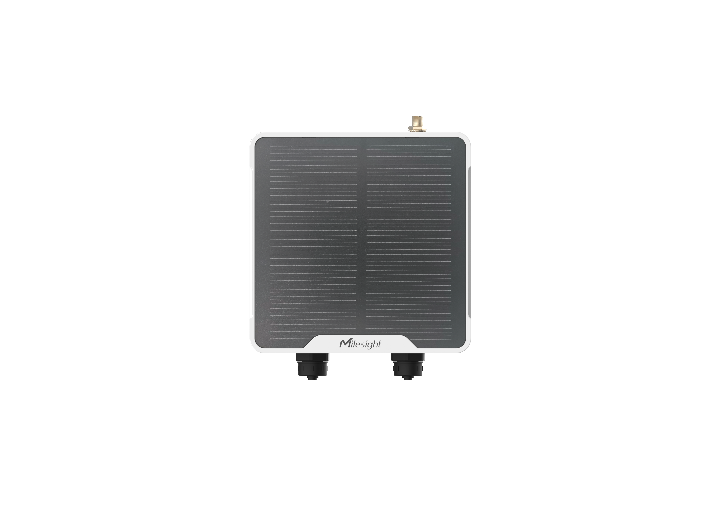
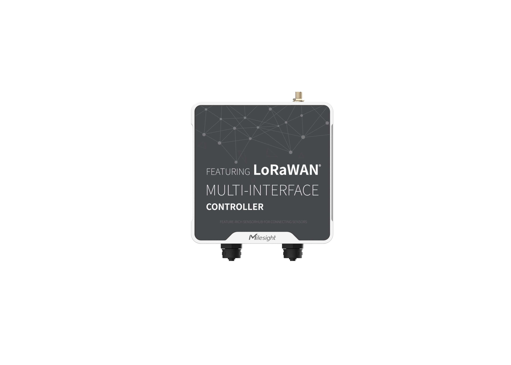

# Multi-interface Controller - Milesight IoT

The payload decoder function is applicable to UC501 / UC502.

For more detailed information, please visit [Milesight official website](https://www.milesight-iot.com).

|        UC501 v3        |        UC502 v3        |
| :--------------------: | :--------------------: |
|  |  |

## Payload Definition

|              CHANNEL               |  ID  | TYPE | LENGTH | DESCRIPTION                                                                                                                                                                                                                                                    |
| :--------------------------------: | :--: | :--: | :----: | -------------------------------------------------------------------------------------------------------------------------------------------------------------------------------------------------------------------------------------------------------------- |
|              Battery               | 0x01 | 0x75 |   1    | unit: %                                                                                                                                                                                                                                                        |
|    GPIO 1<br />(digital input)     | 0x03 | 0x00 |   1    | gpio_1(1B)<br />gpio_1, values: (0: low, 1: high)                                                                                                                                                                                                              |
|    GPIO 2<br />(digital input)     | 0x04 | 0x00 |   1    | gpio_2(1B)<br />gpio_2, values: (0: low, 1: high)                                                                                                                                                                                                              |
|    GPIO 1<br />(digital output)    | 0x03 | 0x01 |   1    | gpio_1(1B)<br />gpio_1, values: (0: low, 1: high)                                                                                                                                                                                                              |
|    GPIO 2<br />(digital output)    | 0x04 | 0x01 |   1    | gpio_1(1B)<br />gpio_1, values: (0: low, 1: high)                                                                                                                                                                                                              |
|       GPIO 1<br />(counter)        | 0x03 | 0xC8 |   4    | counter_1(4B)                                                                                                                                                                                                                                                  |
|       GPIO 2<br />(counter)        | 0x04 | 0xC8 |   4    | counter_2(4B)                                                                                                                                                                                                                                                  |
|         Analog Input Type          | 0xFF | 0x14 |   1    | adc_id(7..4) + adc_id_type(3..0)<br />adc_id_type, values: (0: current, 1: voltage)                                                                                                                                                                            |
|      ADC 1<br />(version: v2)      | 0x05 | 0x02 |   8    | adc_1(2B) + adc_1_min(2B) + adc_1_max(2B) + adc_1_avg(2B)<br />adc_1, read: int16 /1000                                                                                                                                                                        |
|      ADC 2<br />(version: v2)      | 0x06 | 0x02 |   8    | adc_2(2B) + adc_2_min(2B) + adc_2_max(2B) + adc_2_avg(2B)<br />adc_2, read: int16 /1000                                                                                                                                                                        |
|      ADC 1<br />(version: v3)      | 0x05 | 0xE2 |   8    | adc_1(2B) + adc_1_min(2B) + adc_1_max(2B) + adc_1_avg(2B)<br />adc_1, read: float16                                                                                                                                                                            |
|      ADC 2<br />(version: v3)      | 0x06 | 0xE2 |   8    | adc_2(2B) + adc_2_min(2B) + adc_2_max(2B) + adc_2_avg(2B)<br />adc_2, read: float16                                                                                                                                                                            |
|     SDI-12<br />(version: v3)      | 0x08 | 0xDB |   37   | channel_id(1B) + channel_data(36B)                                                                                                                                                                                                                             |
|               RS485                | 0xFF | 0x0E |   N    | channel_id(1B) + channel_def(1B) + data(MB)<br />channel_def, modbus_type(0..2) + data_length(3..7)<br />modbus_type, values: (0: COIL, 1: DIS, 2: REG INPUT, 3: REG HOLD INT16, 4: REG HOLD INT32, 5: REG HOLD FLOAT, 6: REG INPUT INT32, 7: REG INPUT FLOAT) |
|            RS485 Fault             | 0xFF | 0x15 |   1    | modbus_chn_id_alarm(1B)                                                                                                                                                                                                                                        |
|    GPIO 1 Alarm<br />(counter)     | 0x83 | 0xC8 |   5    | counter_1(4B)+ counter_1_alarm(1B)                                                                                                                                                                                                                             |
|    GPIO 2 Alarm<br />(counter)     | 0x84 | 0xC8 |   5    | counter_2(4B) + counter_2_alarm(1B)                                                                                                                                                                                                                            |
| GPIO 1 Change Alarm<br />(counter) | 0x93 | 0xC8 |   9    | counter_1(4B) + counter_1_change(4B) + counter_1_alarm(1B)                                                                                                                                                                                                     |
| GPIO 2 Change Alarm<br />(counter) | 0x94 | 0xC8 |   9    | counter_2(4B) + counter_2_change(4B) + counter_2_alarm(1B)                                                                                                                                                                                                     |
|            ADC 1 Alarm             | 0x85 | 0xE2 |   9    | adc_1(2B) + adc_1_min(2B) + adc_1_max(2B) + adc_1_avg(2B) + adc_1_alarm(1B)<br />read: float16<br />adc_1_alarm, values: (0: threshold, 1: value change)                                                                                                       |
|            ADC 2 Alarm             | 0x86 | 0xE2 |   9    | adc_2(2B) + adc_2_min(2B) + adc_2_max(2B) + adc_2_avg(2B) + adc_2_alarm(1B)<br />read: float16<br />adc_2_alarm, values: (0: threshold, 1: value change)                                                                                                       |
|         ADC 1 Change Alarm         | 0x95 | 0xE2 |   13   | adc_1(2B) + adc_1_min(2B) + adc_1_max(2B) + adc_1_avg(2B) + adc_1_change(4B) + adc_1_alarm(1B)<br />read: float16<br />adc_1_alarm, values: (0: threshold, 1: value change)                                                                                    |
|         ADC 2 Change Alarm         | 0x96 | 0xE2 |   13   | adc_2(2B) + adc_2_min(2B) + adc_2_max(2B) + adc_2_avg(2B) + adc_2_change(4B) + adc_2_alarm(1B)<br />read: float16<br />adc_2_alarm, values: (0: threshold, 1: value change)                                                                                    |
|            RS485 Alarm             | 0x80 | 0x0E |   N    | channel_id(1B) + channel_def(1B) + data(MB) + modbus_chn_id_alarm(1B)<br />modbus_chn_id_alarm, values: (0: threshold 1: value change)                                                                                                                         |
|         RS485 Change Alarm         | 0x90 | 0x0E |   N    | channel_id(1B) + channel_def(1B) + data(MB) + modbus_chn_id_change(4B) + modbus_chn_id_alarm(1B)<br />modbus_chn_id_alarm, values: (0: threshold 1: value change)                                                                                              |
|           Sensor History           | 0x20 | 0xDC |   22   | timestamp(4B) + gpio_1_type(1B) + gpio_1_data(4B) + gpio_2_type(1B) + gpio_2_data(4B) + ai_1_data(4B) + ai_2_data(4B)                                                                                                                                          |
|           Modbus History           | 0x20 | 0xDD |   N    | timestamp(4B) + modbus_mask(2B) + modbus_data(M\* 5B)                                                                                                                                                                                                          |
|           SDI-12 History           | 0x20 | 0xE0 |   N    | timestamp(4B) + sdi_mask(2B) + sdi_data(M\* 36B)                                                                                                                                                                                                               |

## Example

```json
// 017564
{
    "battery": 100
}

// 030001
{
    "gpio_1": "high"
}

// 03C870170000
{
    "counter_1": 6000
}

// 0502983A000000000000
{
    "adc_1": 15,
    "adc_1_avg": 0,
    "adc_1_max": 0,
    "adc_1_min": 0
}

// FF0E092610270000
{
    "modbus_chn_3": 10000
}

// FF1507
{
    "modbus_chn_1_exception": "read error"
}

// 08DB02612B312E362B302B32352E370D0A00000000000000000000000000000000000000000000
{
    "sdi12_3": "a+1.6+0+25.7\r\n"
}
```
