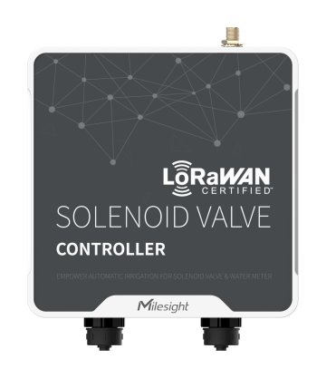

# Solenoid Valve Controller - Milesight IoT

The payload decoder function is applicable to UC511 / UC512.

For more detailed information, please visit [milesight official website](https://www.milesight-iot.com).

|         UC511          |         UC512          |
| :--------------------: | :--------------------: |
|  |  |

## Payload Definition

|     CHANNEL     |  ID  | TYPE | LENGTH | DESCRIPTION                                                                                           |
| :-------------: | :--: | :--: | :----: | ----------------------------------------------------------------------------------------------------- |
|     Battery     | 0x01 | 0x75 |   1    | battery(1B)<br/>battery, unit：%                                                                      |
|     Valve 1     | 0x03 | 0x01 |   1    | valve_1(1B)<br/>valve_1, values: (0：close, 1：open)                                                  |
|  Valve 1 Pulse  | 0x04 | 0xC8 |   4    | valve_1_pulse(4B)                                                                                     |
|     Valve 2     | 0x05 | 0x01 |   1    | valve_2(1B)<br/>valve_2, values: (0：close, 1：open)                                                  |
|  Valve 2 Pulse  | 0x06 | 0xC8 |   4    | valve_2_pulse(4B)                                                                                     |
|     GPIO 1      | 0x07 | 0x01 |   1    | gpio_1(1B)<br/>gpio_1, values: (0：off, 1：on)                                                        |
|     GPIO 2      | 0x08 | 0x01 |   1    | gpio_2(1B)<br/>gpio_2, values: (0：off, 1：on)                                                        |
|  Pipe Pressure  | 0x09 | 0x7B |   2    | pressure(2B)<br/>pressure, unit: kPa                                                                  |
|   Custom Text   | 0xFF | 0x12 |   8    | text(8B)                                                                                              |
|   Rule Engine   | 0xFE | 0x55 |   28   | rule_index(1B) + enable(1b) + condition(13B) + action(13B)                                            |
| Historical Data | 0x20 | 0xCE |   9    | timestamp(4B) + status(1B) + pulse(4B)<br/>NOTE: the data of two solenoid valves are sent separately. |
| Historical Data | 0x21 | 0xCE |   6    | timestamp(4B) + pressure(2B)                                                                          |

**Rule Engine Condition**
- condition_type(1B) + condition_data(NB)
```
| condition_type                           | condition_data                                                                         |
| :--------------------------------------- | :------------------------------------------------------------------------------------- |
| 0x00(none)                               | reserved(12B)                                                                          |
| 0x01(time_condition)                     | start_time(4B) + end_time(4B) + repeat_enabled(1B) + repeat_type(1B) + repeat_step(2B) |
| 0x02(d2d_condition)                      | d2d_command(2B) + reserved(10B)                                                        |
| 0x03(time_and_pulse_threshold_condition) | valve_index(1B) + duration_time(2B) + pulse_threshold(4B) + reserved(5B)               |
| 0x04(pulse_threshold_condition)          | valve_index(1B) + pulse_threshold(4B) + reserved(7B)                                   |
```

- repeat_type == 'monthly' or 'daily', use repeat_step as int type
- repeat_type == 'weekly', use repeat_time as array type
    - e.g. ["monday", "friday"], repeat_step is ignored

**Rule Engine Action**
- action_type(1B) + action_data(NB)
```
| action_type                           | action_data                                                                                                         |
| :------------------------------------ | :------------------------------------------------------------------------------------------------------------------ |
| 0x00(none)                            | reserved(12B)                                                                                                       |
| 0x01(time_and_pulse_threshold_action) | valve_index(1B) + valve_status(1B) + time_enabled(1B) + duration_time(4B) + pulse_enabled(2B) + pulse_threshold(4B) |
| 0x02(time_and_pulse_threshold_action) | valve_index(1B) + valve_status(1B) + time_enabled(1B) + duration_time(4B) + pulse_enabled(2B) + pulse_threshold(4B) |
| 0x03(device_status_report)            | report_type(1B)(value=1/2) + valve_index(1B) + reserved(11B)                                                        |
| 0x03(custom_message_report)           | report_type(1B)(value=3) + text(8B) + reserved(3B)                                                                  |
```

## Example

```json
// 01755C 030100 04C805000000
{
    "battery": 92,
    "valve_1": "close",
    "valve_1_pulse": 5
}


// 20CE3FA109641700000000
{
    "history": [
        {
            "gpio_2": "on",
            "mode": "gpio",
            "timestamp": 1678352703,
            "valve_2": "open"
        }
    ]
}
```
