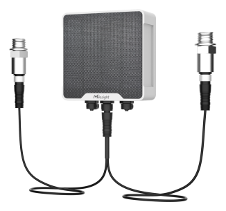

# Electric Valve Controller - Milesight IoT

The payload decoder function is applicable to UC521.

For more detailed information, please visit [Milesight Official Website (UC521)](https://www.milesight.cn/lorawan/controller/uc521/).



## Payload Definition

### Attributes

|     CHANNEL      |  ID  | TYPE | LENGTH | DESCRIPTION          |
| :--------------: | :--: | :--: | :----: | -------------------- |
|   IPSO Version   | 0xFF | 0x01 |   1    | ipso_version(1B)     |
|  Device Status   | 0xFF | 0x0B |   1    | device_status(1B)    |
|  Serial Number   | 0xFF | 0x16 |   8    | sn(8B)               |
| Hardware Version | 0xFF | 0x09 |   2    | hardware_version(2B) |
| Firmware Version | 0xFF | 0x0A |   2    | firmware_version(2B) |
|  LoRaWAN Class   | 0xFF | 0x0F |   1    | lorawan_class(1B)    |
|   TSL Version    | 0xFF | 0xFF |   2    | tsl_version(2B)      |
|   Reset Event    | 0xFF | 0xFE |   1    | reset_event(1B)      |

### Telemetry

|         CHANNEL          |  ID  | TYPE | LENGTH | DESCRIPTION                                                                                                                                                                                                                                                                                                                                                          |
| :----------------------: | :--: | :--: | :----: | -------------------------------------------------------------------------------------------------------------------------------------------------------------------------------------------------------------------------------------------------------------------------------------------------------------------------------------------------------------------- |
|         Battery          | 0x01 | 0x75 |   1    | battery(1B)                                                                                                                                                                                                                                                                                                                                                          |
|      Valve 1 Status      | 0x03 | 0xF6 |   2    | valve_1_type(1B) + valve_1_status(1B)                                                                                                                                                                                                                                                                                                                                |
|      Valve 1 Pulse       | 0x04 | 0xC8 |   4    | valve_1_pulse(4B)                                                                                                                                                                                                                                                                                                                                                    |
|      Valve 2 Status      | 0x05 | 0xF6 |   2    | valve_2_type(1B) + valve_2_status(1B)                                                                                                                                                                                                                                                                                                                                |
|      Valve 2 Pulse       | 0x06 | 0xC8 |   4    | valve_2_pulse(4B)                                                                                                                                                                                                                                                                                                                                                    |
|      GPIO 1 Status       | 0x07 | 0x01 |   1    | gpio_1_status(1B)                                                                                                                                                                                                                                                                                                                                                    |
|      GPIO 2 Status       | 0x08 | 0x01 |   1    | gpio_2_status(1B)                                                                                                                                                                                                                                                                                                                                                    |
|        Pressure 1        | 0x09 | 0x7B |   2    | pressure_1(2B)<br />pressure_1, unit: kPa                                                                                                                                                                                                                                                                                                                            |
|        Pressure 2        | 0x0A | 0x7B |   2    | pressure_2(2B)<br />pressure_2, unit: kPa                                                                                                                                                                                                                                                                                                                            |
|     Pressure 1 Alarm     | 0x0B | 0xF5 |   9    | pressure_source(1B) + condition(1B) + min_threshold(2B) + max_threshold(2B) + pressure(2B) + alarm(1B)<br />pressure_source, values: (0: every change, 1: valve 1 opening, 2: valve 2 opening, 3: valve 1 opening or valve 2 opening)<br />condition, values: (0: none, 1: below, 2: above, 3: between, 4: outside)<br />alarm, values: (0: alarm release, 1: alarm) |
|     Pressure 2 Alarm     | 0x0C | 0xF5 |   9    | pressure_source(1B) + condition(1B) + min_threshold(2B) + max_threshold(2B) + pressure(2B) + alarm(1B)<br />pressure_source, values: (0: every change, 1: valve 1 opening, 2: valve 2 opening, 3: valve 1 opening or valve 2 opening)<br />condition, values: (0: none, 1: below, 2: above, 3: between, 4: outside)<br />alarm, values: (0: alarm release, 1: alarm) |
| Valve Calibration Result | 0x0D | 0xE3 |   4    | valve_index(1B) + source_value(1B) + target_value(1B) + result(1B)<br />valve_index, values: (0: valve_1, 1: valve_2)<br />result, values: (0: failed, 1: success)                                                                                                                                                                                                   |
| Valve 1 Opening Duration | 0x0E | 0x01 |   1    | valve_1_opening_duration(1B)<br />valve_1_opening_duration, unit: s                                                                                                                                                                                                                                                                                                  |
| Valve 2 Opening Duration | 0x0F | 0x01 |   1    | valve_2_opening_duration(1B)<br />valve_2_opening_duration, unit: s                                                                                                                                                                                                                                                                                                  |
|  Valve 1 Sensor Status   | 0xB3 | 0xF6 |   2    | valve_1_type(1B) + valve_1_sensor_status(1B)<br />valve_1_type, values: (0: two-way ball, 1: three-way ball)<br />valve_1_sensor_status, values: (0: low battery power, 1: shutdown after getting io feedback, 2: incorrect opening time, 3: timeout, 4: valve stall)                                                                                                |
|  Valve 2 Sensor Status   | 0xB5 | 0xF6 |   2    | valve_2_type(1B) + valve_2_sensor_status(1B)<br />valve_2_type, values: (0: two-way ball, 1: three-way ball)<br />valve_2_sensor_status, values: (0: low battery power, 1: shutdown after getting io feedback, 2: incorrect opening time, 3: timeout, 4: valve stall)                                                                                                |
| Pressure 1 Sensor Status | 0xB9 | 0x7B |   1    | pressure_1_sensor_status(1B)<br />pressure_1_sensor_status: values: (1: abnormal)                                                                                                                                                                                                                                                                                    |
| Pressure 2 Sensor Status | 0xBA | 0x7B |   1    | pressure_2_sensor_status(1B)<br />pressure_2_sensor_status: values: (1: abnormal)                                                                                                                                                                                                                                                                                    |

## Example

```json
// 017564 03F60032 0A7B1100
{
    "battery": 100,
    "pressure_2": 17,
    "valve_1_opening": 50,
    "valve_1_type": "2-way ball valve"
}
```
