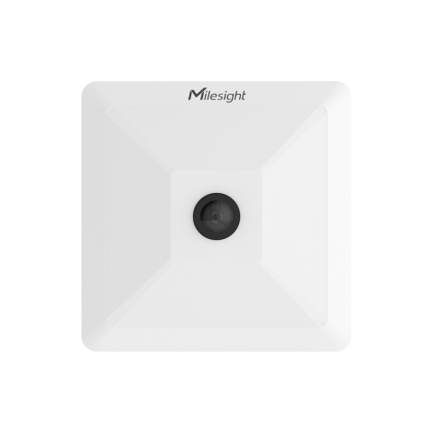

# AI Workplace Occupancy Sensor - Milesight IoT

The payload decoder function is applicable to VS121.

For more detailed information, please visit [milesight official website](https://www.milesight-iot.com).



## Payload Definition

|       CHANNEL        |  ID  | TYPE | LENGTH | DESCRIPTION                                               |
| :------------------: | :--: | :--: | :----: | --------------------------------------------------------- |
|   Protocol Version   | 0xFF | 0x01 |   1    | protocol_version(1B)                                      |
|    Serial Number     | 0xFF | 0x08 |   6    | sn(6B)                                                    |
|   Hardware Version   | 0xFF | 0x09 |   2    | hardware_version(2B)                                      |
|   Firmware Version   | 0xFF | 0x1F |   4    | firmware_version(4B)                                      |
|     People Count     | 0x04 | 0xC9 |   4    | people_count_all(1B) + region_count(1B) + region_mask(2B) |
|    People Passing    | 0x05 | 0xCC |   4    | people_in(2B) + people_out(2B)                            |
|      People Max      | 0x06 | 0xCD |   1    | people_count_max(1B)                                      |
|  Region Count(1-8)   | 0x07 | 0xD5 |   8    | region_1(1B) + region_2(1B) + ... + region_8(1B)          |
|  Region Count(9-16)  | 0x08 | 0xD5 |   8    | region_9(1B) + region_10(1B) + ... + region_16(1B)        |
|        A flow        | 0x09 | 0xDA |   8    | AtoA(2B) + AtoB(2B) + ... + AtoD(2B)                      |
|        B flow        | 0x0A | 0xDA |   8    | BtoA(2B) + BtoB(2B) + ... + BtoD(2B)                      |
|        C flow        | 0x0B | 0xDA |   8    | CtoA(2B) + CtoB(2B) + ... + CtoD(2B)                      |
|        D flow        | 0x0C | 0xDA |   8    | DtoA(2B) + DtoB(2B) + ... + DtoD(2B)                      |
|        D flow        | 0x0C | 0xDA |   8    | DtoA(2B) + DtoB(2B) + ... + DtoD(2B)                      |
| People Total Passing | 0x0D | 0xCC |   4    | people_total_in(2B) + people_total_out(2B)                |
|      Dwell Time      | 0x0E | 0xE4 |   5    | id(1B) + dwell_avg(2B) + dwell_max(2B)                    |
|      Timestamp       | 0x0F | 0x85 |   4    | timestamp(4B)                                             |

## Example

```json
// FF0101 FF086600B0940976 FF090100 FF1F1F07004B
{
    "protocol_version": 1,
    "sn": "6600b0940976",
    "hardware_version": "1.0",
    "firmware_version": "31.7.0.75"
}

// 04C9030800A1 06CD05
{
    "people_count_all": 3,
    "region_count": 8,
    "region_1": 1,
    "region_2": 0,
    "region_3": 0,
    "region_4": 0,
    "region_5": 0,
    "region_6": 1,
    "region_7": 0,
    "region_8": 1,
    "people_count_max": 5
}

// 07D50001000000000003 08D50100000000000000
{
    "region_1_count": 0,
    "region_2_count": 1,
    "region_3_count": 0,
    "region_4_count": 0,
    "region_5_count": 0,
    "region_6_count": 0,
    "region_7_count": 0,
    "region_8_count": 3,
    "region_9_count": 1,
    "region_10_count": 0,
    "region_11_count": 0,
    "region_12_count": 0,
    "region_13_count": 0,
    "region_14_count": 0,
    "region_15_count": 0,
    "region_16_count": 0,
}

// 05CC02000100
{
    "people_in": 2,
    "people_out": 1
}

// 09DA0001000200000000 0ADA0000000000000000 0BDA0000000000000012 0CDA0000000000000000
{
    "a_to_a": 256,
    "a_to_b": 512,
    "a_to_c": 0,
    "a_to_d": 0,
    "b_to_a": 0,
    "b_to_b": 0,
    "b_to_c": 0,
    "b_to_d": 0,
    "c_to_a": 0,
    "c_to_b": 0,
    "c_to_c": 0,
    "c_to_d": 4608,
    "d_to_a": 0,
    "d_to_b": 0,
    "d_to_c": 0,
    "d_to_d": 0
}
```
