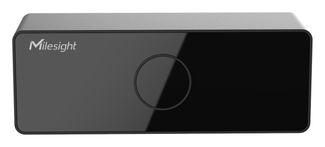

# 3D ToF People Counting Sensor - Milesight IoT

The payload decoder function is applicable to VS132.

For more detailed information, please visit [milesight official website](https://www.milesight-iot.com).



## Payload Definition

|     CHANNEL      |  ID  | TYPE | LENGTH | DESCRIPTION                                        |
| :--------------: | :--: | :--: | :----: | -------------------------------------------------- |
| Protocol Version | 0xFF | 0x01 |   1    | protocol_version(1B)                               |
|  Serial Number   | 0xFF | 0x16 |   8    | sn(8B)                                             |
| Hardware Version | 0xFF | 0x09 |   2    | hardware_version(2B)                               |
| Firmware Version | 0xFF | 0x1F |   4    | firmware_version(4B)                               |
|     Total IN     | 0x03 | 0xD2 |   4    | total_counter_in(4B)                               |
|    Total OUT     | 0x04 | 0xD2 |   4    | total_counter_out(4B)                              |
|  Period IN/OUT   | 0x05 | 0xCC |   4    | periodic_counter_in(2B) + periodic_counter_out(2B) |

## Example

```json
// FF0101 FF166614C39694870000 FF090102 FF1F84010001 03D2BE000000 04D231010000 05CC00000000
{
    "protocol_version": 1,
    "sn": "6614c39694870000",
    "hardware_version": "1.2",
    "firmware_version": "132.1.0.1",
    "total_counter_in": 190,
    "total_counter_out": 305,
    "periodic_counter_in": 0,
    "periodic_counter_out": 0
}
```
