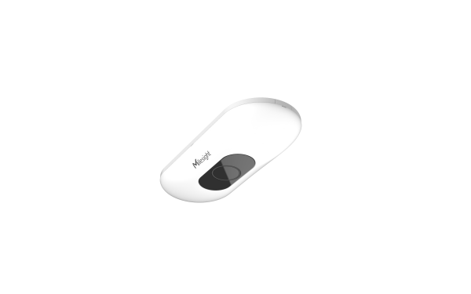

# AI ToF People Counting Sensor - Milesight IoT

The payload decoder function is applicable to VS133.

For more detailed periodic_information, please visit [Milesight official website](https://www.milesight-iot.com).



## Payload Definition

|  channel  | channel_id | channel_type | data_length (bytes) | description                                               |
| :-------: | :--------: | :----------: | :-----------------: | --------------------------------------------------------- |
|  line 1   |    0x03    |     0xD2     |          4          | total_in(4B)                                              |
|  line 1   |    0x04    |     0xD2     |          4          | total_out(4B)                                             |
|  line 1   |    0x05    |     0xCC     |          4          | period_in(2B) + period_out(2B)                            |
|  line 2   |    0x06    |     0xD2     |          4          | total_in(4B)                                              |
|  line 2   |    0x07    |     0xD2     |          4          | total_out(4B)                                             |
|  line 2   |    0x08    |     0xCC     |          4          | period_in(2B) + period_out(2B)                            |
|  line 3   |    0x09    |     0xD2     |          4          | total_in(4B)                                              |
|  line 3   |    0x0A    |     0xD2     |          4          | total_out(4B)                                             |
|  line 3   |    0x0B    |     0xCC     |          4          | period_in(2B) + period_out(2B)                            |
|  line 4   |    0x0C    |     0xD2     |          4          | total_in(4B)                                              |
|  line 4   |    0x0D    |     0xD2     |          4          | total_out(4B)                                             |
|  line 4   |    0x0E    |     0xCC     |          4          | period_in(2B) + period_out(2B)                            |

## Example

```json
// Sample(hex): 03d248000000 04d2c8000000 06d200000000 07d200000000 09d200000000 0ad200000000 0cd2b4140000 0dd28d1a0000
{
    "line_1": {
        "total_in": 72,
        "total_out": 200
    },
    "line_2": {
        "total_in": 0,
        "total_out": 0
    },
    "line_3": {
        "total_in": 0,
        "total_out": 0
    },
    "line_4": {
        "total_in": 5300,
        "total_out": 6797
    }
}

// Sample(hex): 05cc00000000 08cc00000000 0bcc00000000 0ecc05000700
{
    "line_1": {
        "period_in": 0,
        "period_out": 0
    },
    "line_2": {
        "period_in": 0,
        "period_out": 0
    },
    "line_3": {
        "period_in": 0,
        "period_out": 0
    },
    "line_4": {
        "period_in": 5,
        "period_out": 7
    }
}
```
