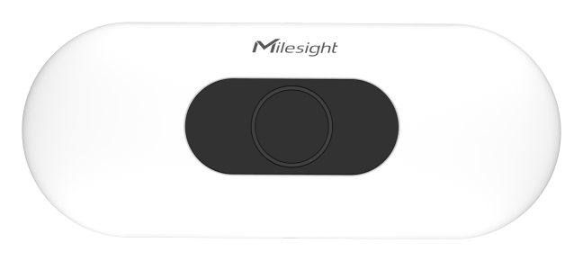
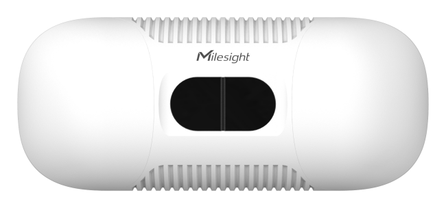

# AI ToF People Counting Sensor - Milesight IoT

The payload decoder function is applicable to VS133 / VS135.

For more detailed information, please visit [Milesight official website](https://www.milesight-iot.com).

|        VS133        |        VS135        |
| :-----------------: | :-----------------: |
|  |  |

## Payload Definition

|           CHANNEL           |  ID  | TYPE | LENGTH | DESCRIPTION                                                                       |
| :-------------------------: | :--: | :--: | :----: | --------------------------------------------------------------------------------- |
|   Total In<br />(Line 1)    | 0x03 | 0xD2 |   4    | line_1_total_in(4B)                                                               |
|   Total Out<br />(Line 1)   | 0x04 | 0xD2 |   4    | line_1_total_out(4B)                                                              |
| Period IN/OUT<br />(Line 1) | 0x05 | 0xCC |   4    | line_1_period_in(2B) + line_1_period_out(2B)                                      |
|   Total In<br />(Line 2)    | 0x06 | 0xD2 |   4    | line_2_total_in(4B)                                                               |
|   Total Out<br />(Line 2)   | 0x07 | 0xD2 |   4    | line_2_total_out(4B)                                                              |
| Period IN/OUT<br />(Line 2) | 0x08 | 0xCC |   4    | line_2_period_in(2B) + line_2_period_out(2B)                                      |
|   Total In<br />(Line 3)    | 0x09 | 0xD2 |   4    | line_3_total_in(4B)                                                               |
|   Total Out<br />(Line 3)   | 0x0A | 0xD2 |   4    | line_3_total_out(4B)                                                              |
| Period IN/OUT<br />(Line 3) | 0x0B | 0xCC |   4    | line_3_period_in(2B) + line_3_period_out(2B)                                      |
|   Total In<br />(Line 4)    | 0x0C | 0xD2 |   4    | line_4_total_in(4B)                                                               |
|   Total Out<br />(Line 4)   | 0x0D | 0xD2 |   4    | line_4_total_out(4B)                                                              |
| Period IN/OUT<br />(Line 4) | 0x0E | 0xCC |   4    | line_4_period_in(2B) + line_4_period_out(2B)                                      |
|        Region Count         | 0x0F | 0xE3 |   4    | region_1_count(1B) + region_2_count(1B) + region_3_count(1B) + region_4_count(1B) |
|         Dwell Time          | 0x10 | 0xE4 |   5    | region(1B) + region_avg_dwell(2B) + region_max_dwell(2B)                          |

## Example

```json
// 03D248000000 04D2C8000000 06D200000000 07D200000000 09D200000000 0AD200000000 0CD2B4140000 0DD28D1A0000
{
    "line_1_total_in": 72,
    "line_1_total_out": 200,
    "line_2_total_in": 0,
    "line_2_total_out": 0,
    "line_3_total_in": 0,
    "line_3_total_out": 0,
    "line_4_total_in": 5300,
    "line_4_total_out": 6797
}

// 05CC00000000 08CC00000000 0BCC00000000 0ECC05000700
{
    "line_1_period_in": 0,
    "line_1_period_out": 0,
    "line_2_period_in": 0,
    "line_2_period_out": 0,
    "line_3_period_in": 0,
    "line_3_period_out": 0,
    "line_4_period_in": 5,
    "line_4_period_out": 7
}

// 0FE302100709
{
    "region_1_count": 2,
    "region_2_count": 16,
    "region_3_count": 7,
    "region_4_count": 9
}

// 10E40109101121 10E40275217533 10E40381212389 10E40476001387
{
    "region_1_avg_dwell": 4105,
    "region_1_max_dwell": 8465,
    "region_2_avg_dwell": 8565,
    "region_2_max_dwell": 13173,
    "region_3_avg_dwell": 8577,
    "region_3_max_dwell": 35107,
    "region_4_avg_dwell": 118,
    "region_4_max_dwell": 34579
}
```
