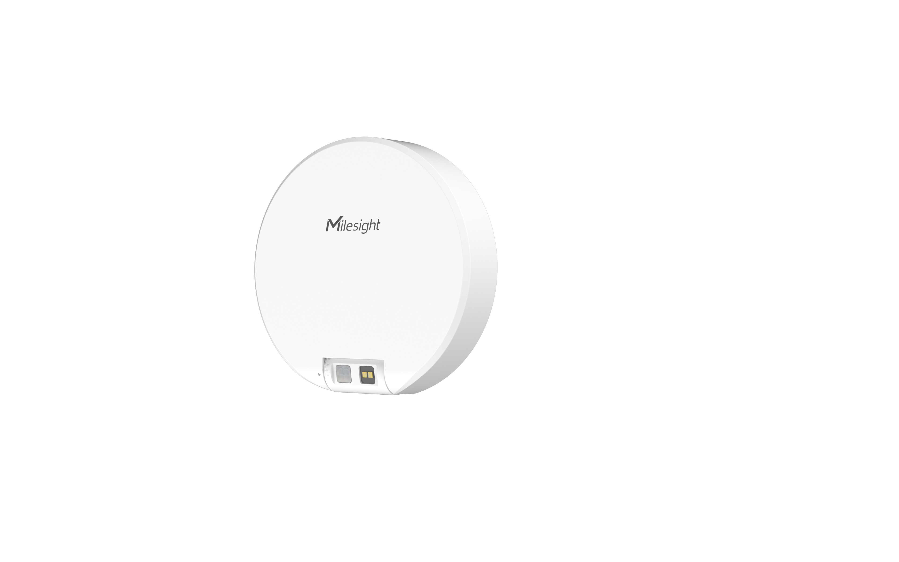

# Bathroom Occupancy Sensor - Milesight IoT

The payload decoder function is applicable to VS330.

For more detailed information, please visit [Milesight Official Website](https://www.milesight.com/iot/product/lorawan-sensor/vs330).



## Payload Definition

|   CHANNEL   |  ID  | TYPE | LENGTH | DESCRIPTION                                                                    |
| :---------: | :--: | :--: | :----: | ------------------------------------------------------------------------------ |
|   Battery   | 0x01 | 0x75 |   1    | battery(1B)<br/>battery, unit: %                                               |
|  Distance   | 0x02 | 0x82 |   2    | distance(2B)<br/>distance, unit: mm                                            |
|  Occupancy  | 0x03 | 0x8E |   1    | occupancy(1B)<br/>occupancy, values: (0: vacant, 1: occupied)                  |
| Calibration | 0x04 | 0x8E |   1    | calibration_status(1B)<br/>calibration_status, values: (0: failed, 1: success) |

## Example

```json
// 017562 02820F00 038E01 048E01

{
    "battery": 98,
    "distance": 15,
    "occupancy": "occupied",
    "calibration_status": "success"
}
```
