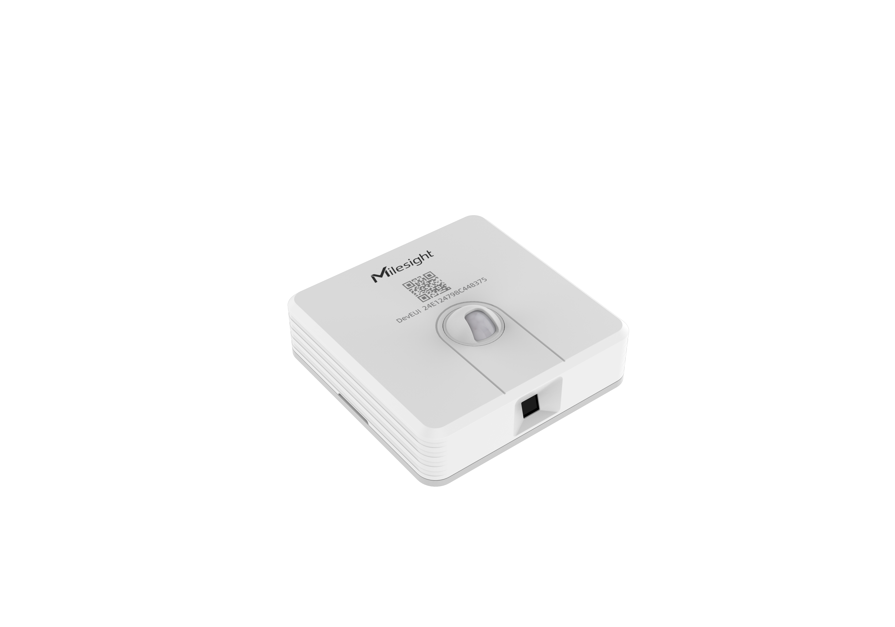

# Desk & Seat Occupancy Sensor - Milesight IoT

The payload decoder function is applicable to VS340/VS341.
For more detailed information, please visit [Milesight official website](https://www.milesight-iot.com).

|        VS340        |        VS341        |
| :-----------------: | :-----------------: |
|  |  |

## Payload Definition

|  CHANNEL  |  ID  | TYPE | LENGTH (bytes) | description                                                  |
| :-------: | :--: | :--: | :------------: | ------------------------------------------------------------ |
|  Battery  | 0x01 | 0x75 |       1        | battery(1B)<br/>battery, unit：%                             |
| Occupancy | 0x03 | 0x00 |       1        | occupancy(1B)<br/>occupancy, values:(0: vacant, 1: occupied) |

## Example

```json
// 017564 030000
{
    "battery": 100,
    "occupancy": "vacant"
}

// 017564 030001
{
    "battery": 100,
    "occupancy": "occupied"
}
```
