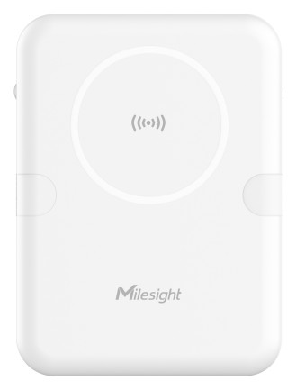

# Radar Fall Detection Sensor - Milesight IoT

The payload decoder function is applicable to VS373.

For more detailed information, please visit [Milesight Official Website](https://www.milesight.com/iot/product/lorawan-sensor/vs373).



## Payload Definition

### ATTRIBUTES

| CHANNEL          |  ID  | TYPE | LENGTH | DESCRIPTION                                                                                   |
| :--------------- | :--: | :--: | :----: | :-------------------------------------------------------------------------------------------- |
| Protocol Version | 0xFF | 0x01 |   1    | ipso_version(1B)                                                                              |
| Device Status    | 0xFF | 0x0B |   1    | device_status(1B)                                                                             |
| Serial Number    | 0xFF | 0x16 |   8    | sn(8B)                                                                                        |
| Hardware Version | 0xFF | 0x09 |   2    | hardware_version(2B)                                                                          |
| Firmware Version | 0xFF | 0x0A |   2    | firmware_version(2B)                                                                          |
| TSL Version      | 0xFF | 0xFF |   2    | tsl_version(2B)                                                                               |
| LoRaWAN Class    | 0xFF | 0x0F |   1    | lorawan_class(1B)<br />lorawan_class, values: (0: classA, 1: classB, 2: classC, 3: classCtoB) |

### TELEMETRY

| CHANNEL                |  ID  | TYPE | LENGTH | DESCRIPTION                                                                                                                                                                                                                                                           |
| :--------------------- | :--: | :--: | :----: | :-------------------------------------------------------------------------------------------------------------------------------------------------------------------------------------------------------------------------------------------------------------------- |
| Room Detection         | 0x03 | 0xF8 |   6    | detection_status(1B) + target_status(1B) + use_time_now(2B) + use_time_today(2B) <br />detection_status, values: (0: normal, 1: vacant, 2: in bed, 3: out of bed, 4: fall) <br />target_status, values: (0: normal, 1: motionless, 2: abnormal)                       |
| Region Detection       | 0x04 | 0xF9 |   4    | region_1_occupancy(1B) + region_2_occupancy(1B) + region_3_occupancy(1B) + region_4_occupancy(1B)<br />region_1_occupancy, values: (0: occupied, 1: vacant)                                                                                                           |
| Region Out of Bed Time | 0x05 | 0xFA |   8    | region_1_out_of_bed_time(2B) + region_2_out_of_bed_time(2B) + region_3_out_of_bed_time(2B) + region_4_out_of_bed_time(2B)<br />region_1_out_of_bed_time, unit: second                                                                                                 |
| Alarm Event            | 0x06 | 0xFB |   5    | alarm_id(2B) + alarm_type(1B) + alarm_status(1B) + alarm_region_id(1B) <br />alarm_type, values: (0: normal, 1: motionless, 2: dwell, 3: out of bed, 4: occupied, 5: vacant) <br />alarm_status, values: (0: alarm triggered, 1: alarm deactivated, 2: alarm ignored) |
| Historical Data        | 0x20 | 0xCE |   9    | timestamp(4B) + alarm_id(2B) + alarm_type(1B) + alarm_status(1B) + alarm_region_id(1B)                                                                                                                                                                                |

# Sample

```json

```
