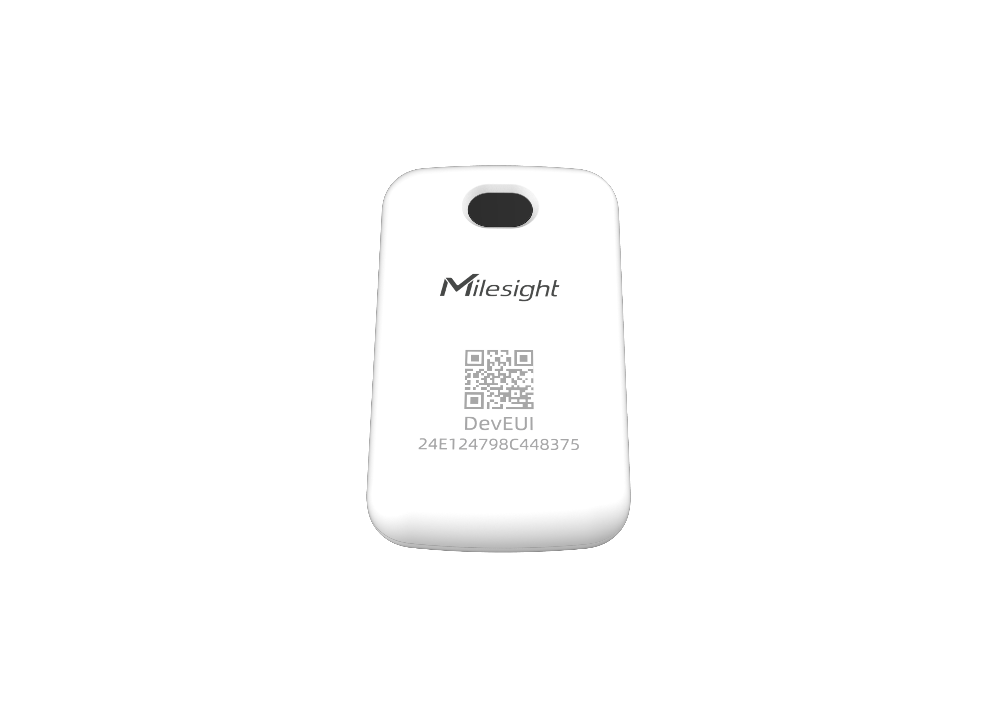

# Smart Fill Level Monitoring Sensor - Milesight IoT

The payload decoder function is applicable to WS201.

For more detailed information, please visit [milesight official website](https://www.milesight-iot.com).



## Payload Definition

|  CHANNEL  |  ID  | TYPE | LENGTH | DESCRIPTION                          |
| :-------: | :--: | :--: | :----: | ------------------------------------ |
|  Battery  | 0x01 | 0x75 |   1    | battery(1B)<br/>battery, unit: %     |
| Distance  | 0x03 | 0x82 |   2    | distance(2B)<br/>distance, unit: mm  |
| Remaining | 0x04 | 0xD6 |   1    | remaining(1B)<br/>remaining, unit: % |

## Example

```json
// 017564 03823E00 04D645
{
    "battery": 100,
    "distance": 62,
    "remaining": 69
}
```
