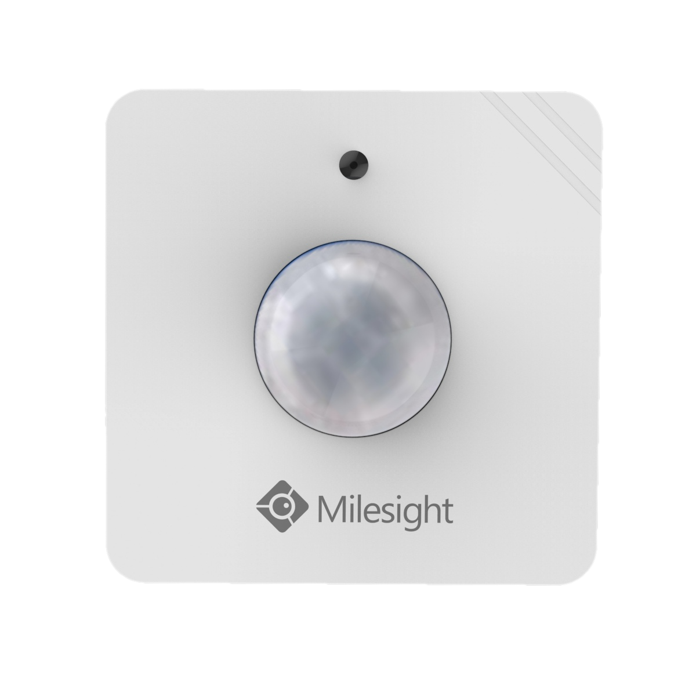

# PIR & Light Sensor - Milesight IoT

The payload decoder function applies to WS202.

For more detailed information, please visit Milesight's [official website](https://www.milesight-iot.com).



## Payload Definition

### Attribute

|      CHANNEL       |  ID  | TYPE | LENGTH | DESCRIPTION          |
| :----------------: | :--: | :--: | :----: | -------------------- |
|  Protocol Version  | 0xFF | 0x01 |   1    | protocol_version(1B) |
|    Power Status    | 0xFF | 0x0B |   1    | power_status(1B)     |
|   Serial Number    | 0xFF | 0x16 |   8    | sn(8B)               |
|  Hardware Version  | 0xFF | 0x09 |   2    | hardware_version(2B) |
|  Firmware Version  | 0xFF | 0x0A |   2    | firmware_version(2B) |
| LoRaWAN Class Type | 0xFF | 0x0F |   1    | lorawan_class(1B)    |
|    TSL Version     | 0xFF | 0xFF |   2    | tsl_version(2B)      |

### Telemetry

| CHANNEL  |  ID  | TYPE | LENGTH | DESCRIPTION                                             |
| :------: | :--: | :--: | :----: | ------------------------------------------------------- |
| Battery  | 0x01 | 0x75 |   1    | battery(1B)<br />battery, unit: %                       |
|   PIR    | 0x03 | 0x00 |   1    | pir(1B)<br />pir, values: (0: normal, 1: trigger)       |
| Daylight | 0x04 | 0x00 |   1    | daylight(1B)<br />daylight, values: (0: dark, 1: light) |

## Example

```json
// 017510 030001 040000
{
    "battery": 16,
    "pir": "trigger",
    "daylight": "dark"
}
```
