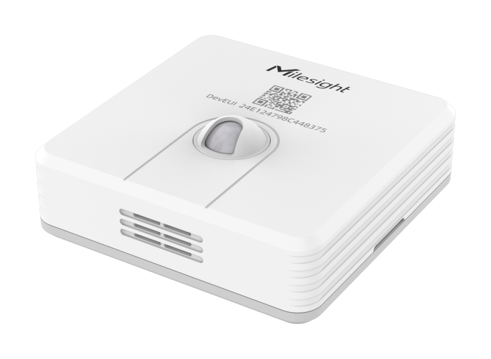

# PIR & Temperature - Milesight IoT

The payload decoder function is applicable to WS203.

For more detailed information, please visit [Milesight official website](https://www.milesight-iot.com).



## Payload Definition

|       CHANNEL        |  ID  | TYPE | LENGTH | DESCRIPTION                                                                                                                                                                                           |
| :------------------: | :--: | :--: | :----: | ----------------------------------------------------------------------------------------------------------------------------------------------------------------------------------------------------- |
|       Battery        | 0x01 | 0x75 |   1    | battery(1B)<br/>battery, unit: %                                                                                                                                                                      |
|     Temperature      | 0x03 | 0x67 |   2    | temperature(2B)<br/>temperature, unit: ℃                                                                                                                                                              |
|       Humidity       | 0x04 | 0x68 |   1    | humidity(1B)<br/>humidity, unit: %RH                                                                                                                                                                  |
|      Occupancy       | 0x05 | 0x00 |   1    | occupancy(1B)<br/>occupancy, values(0: vacant, 1: occupied)                                                                                                                                           |
| Temperature Abnormal | 0x83 | 0x67 |   3    | temperature(2B) + temperature_abnormal(1B)                                                                                                                                                            |
|   Historical Data    | 0x20 | 0xCE |   9    | timestamp(4B) + report_type(1B) + occupancy(1B) + temperature(2B) + humidity(1B)<br/>report_type, values: (0: temperature resume, 1: temperature threshold, 2: pir ilde, 3: pir occupancy, 4: period) |

## Example

```json
// 017564 03673401 046865 050000
{
    "battery": 100,
    "humidity": 50.5,
    "occupancy": "vacant",
    "temperature": 30.8
}

// 8367220101
{
    "temperature": 29,
    "temperature_abnormal": "abnormal"
}

// 20CEAE5BA6640400240165 20CE5C5CA6640301340165
{
    "history": [
        {
            "humidity": 50.5,
            "occupancy": "vacant",
            "report_type": "period",
            "temperature": 29.2,
            "timestamp": 1688624046
        },
        {
            "humidity": 50.5,
            "occupancy": "occupied",
            "report_type": "pir occupancy",
            "temperature": 30.8,
            "timestamp": 1688624220
        }
    ]
}
```
