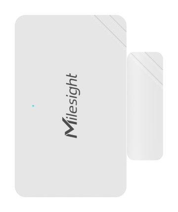

# Magnetic Contact Switch - Milesight IoT

The payload decoder function is applicable to WS301.

For more detailed information, please visit [milesight official website](https://www.milesight-iot.com).



## Payload Definition

|    CHANNEL    |  ID  | TYPE | LENGTH | DESCRIPTION                                                                 |
| :-----------: | :--: | :--: | :----: | --------------------------------------------------------------------------- |
|    Battery    | 0x01 | 0x75 |   1    | battery(1B)<br/>battery, unit: %                                            |
| Magnet Status | 0x03 | 0x00 |   1    | magnet_status(1B)<br/>state, values: (0: close, 1: open)                    |
| Tamper Status | 0x04 | 0x00 |   1    | tamper_status(1B)<br/>tamper_status, values: (0: installed, 1: uninstalled) |

## Example

```json
// 017564 030001 040001
{
    "battery": 100,
    "magnet_status": "open",
    "tamper_status": "installed"
}
```
