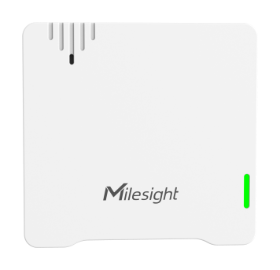

# Sound Contact Switch - Milesight IoT

The payload decoder function is applicable to WS302.

For more detailed information, please visit [milesight official website](https://www.milesight-iot.com).



## Payload Definition

|   CHANNEL   |  ID  | TYPE | LENGTH | DESCRIPTION                            |
| :---------: | :--: | :--: | :----: | -------------------------------------- |
|   Battery   | 0x01 | 0x75 |   1    | battery(1B)<br />battery, unit: %      |
| Sound Level | 0x05 | 0x5B |   7    | wight(1B) + l(2B) + leq(2B) + lmax(2B) |

## Example

```json
// 017564 055B053F02DA016A02
{
    "battery": 100,
    "LAF": 57.5,
    "LAeq": 47.4,
    "LAFmax": 61.8
}
```
