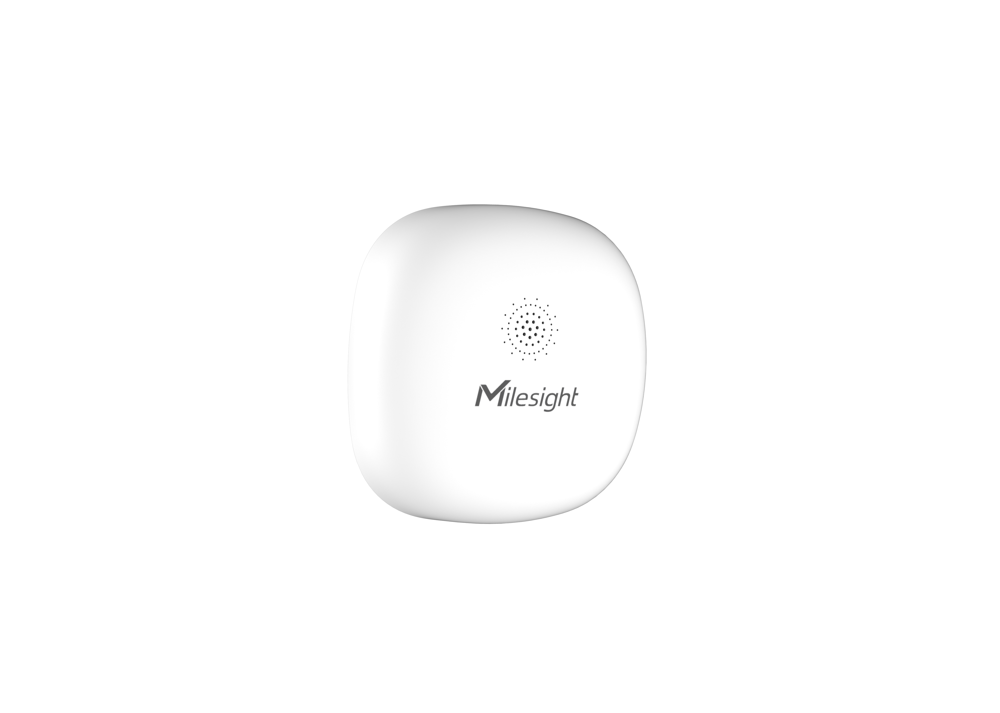

# Mini Leak Detection Sensor - Milesight IoT

The payload decoder function is applicable to WS303.

For more detailed information, please visit [milesight official website](https://www.milesight-iot.com).



## Payload Definition

|    CHANNEL     |  ID  | TYPE | LENGTH | DESCRIPTION                                                 |
| :------------: | :--: | :--: | :----: | ----------------------------------------------------------- |
|    Battery     | 0x01 | 0x75 |   1    | battery(1B)<br/>battery, unit：%                            |
| Leakage Status | 0x03 | 0x00 |   1    | leakage_status(1B)<br/>leakage_status: (0：normal, 1：leak) |

## Example

```json
// 017564 030000
{
    "battery": 100,
    "leakage_status": "normal"
}

// 017564 030001
{
    "battery": 100,
    "leakage_status": "leak"
}
```
