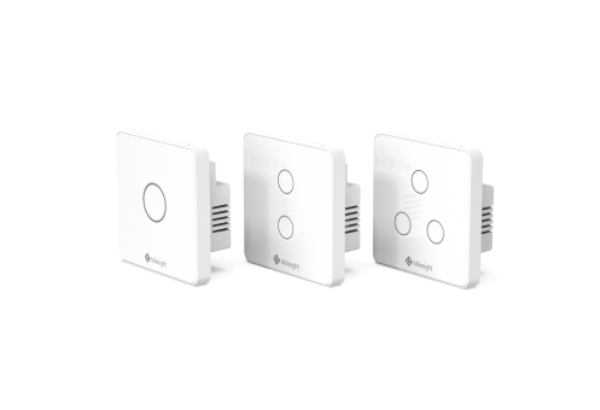

# Smart Wall Switch - Milesight IoT

The payload decoder function is applicable to WS501 / WS502 / WS503.

For more detailed information, please visit [Milesight Official Website](https://www.milesight.com/iot/product/lorawan-sensor/ws50x).

|        WS50x        |
| :-----------------: |
|  |

## Payload Definition

### Attributes

|     CHANNEL      |  ID  | TYPE | LENGTH | DESCRIPTION          |
| :--------------: | :--: | :--: | :----: | -------------------- |
|   IPSO Version   | 0xFF | 0x01 |   1    | ipso_version(1B)     |
| Hardware Version | 0xFF | 0x09 |   2    | hardware_version(2B) |
| Firmware Version | 0xFF | 0x0A |   2    | firmware_version(2B) |
|  Serial Number   | 0xFF | 0x08 |   6    | sn(6B)               |
|  Lorawan Class   | 0xFF | 0x0F |   1    | lorawan_class(1B)    |

### Telemetry

|    CHANNEL    |  ID  | TYPE | LENGTH | DESCRIPTION                  |
| :-----------: | :--: | :--: | :----: | ---------------------------- |
| Switch Status | 0xFF | 0x29 |   1    | switch_1, switch_2, switch_3 |
| Button Status | 0xFF | 0x2B |   1    | button_trigger(1B)           |

### Status Definition

| bits |  7  |        6        |        5        |        4        |  3  |    2     |    1     |    0     |
| :--: | :-: | :-------------: | :-------------: | :-------------: | :-: | :------: | :------: | :------: |
|      |  -  | switch_3_change | switch_2_change | switch_1_change |  -  | switch_3 | switch_2 | switch_1 |

## Example

```json
// FF2931
{
    "switch_1": "on",
    "switch_2": "off",
    "switch_3": "off",
    "switch_1_change": "yes",
    "switch_2_change": "yes",
    "switch_3_change": "no"
}
```
