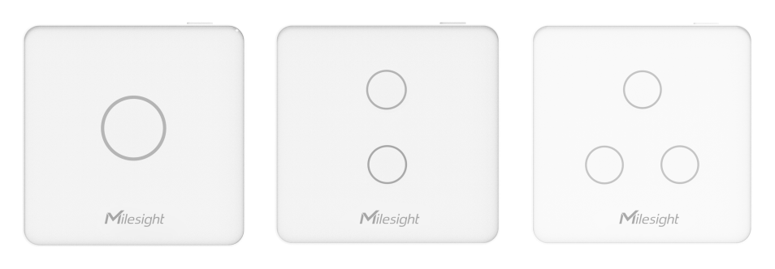
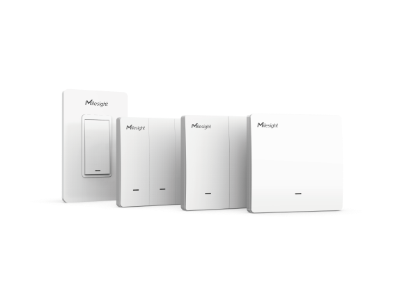

# Smart Wall Switch - Milesight IoT

The payload decoder function is applicable to WS501 / WS502 / WS503.

For more detailed information, please visit [Milesight official website](https://www.milesight-iot.com).

|        WS50x v1        |         WS50x v2          |
| :--------------------: | :-----------------------: |
|  |  |

## Payload Definition

|          CHANNEL           |  ID  | TYPE | LENGTH | DESCRIPTION                                           |
| :------------------------: | :--: | :--: | :----: | ----------------------------------------------------- |
|      Switch<br/>(v1)       | 0xFF | 0x29 |   1    | status(1B)                                            |
|      Voltage<br/>(v2)      | 0x03 | 0x74 |   2    | voltage(2B)<br/>voltage, read: uint16/10              |
|   Active Power<br/>(v2)    | 0x04 | 0x80 |   4    | power(4B)<br/>power, read: uint32, unit: W            |
|   Active Factor<br/>(v2)   | 0x05 | 0x81 |   1    | factor(1B)<br/>factor, read: uint8, unit: %           |
| Power Consumption<br/>(v2) | 0x06 | 0x83 |   4    | power_sum(4B)<br/>power_sum, read: uint32, unit: W\*h |
|      Current<br/>(v2)      | 0x07 | 0xC9 |   2    | current(2B)<br/>current, read: uint16, unit: mA       |
|      Switch<br/>(v2)       | 0x08 | 0x29 |   1    | status(1B)                                            |

### Status Definition

| bits |  7  |        6        |        5        |        4        |  3  |    2     |    1     |    0     |
| :--: | :-: | :-------------: | :-------------: | :-------------: | :-: | :------: | :------: | :------: |
|      |  -  | switch_3_change | switch_2_change | switch_1_change |  -  | switch_3 | switch_2 | switch_1 |

## Example

```json
// FF2931
{
    "switch_1": "on",
    "switch_2": "off",
    "switch_3": "off",
    "switch_1_change": "yes",
    "switch_2_change": "yes",
    "switch_3_change": "no"
}
```
