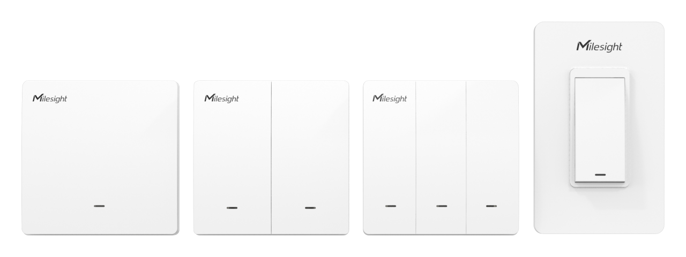

# Smart Wall Switch - Milesight IoT

The payload decoder function is applicable to WS501 / WS502 / WS503.

For more detailed information, please visit [Milesight official website](https://www.milesight-iot.com).

|      WS50x v1       |         WS50x v2          |
| :-----------------: | :-----------------------: |
|  |  |

## Payload Definition

|          channel           | channel_id | channel_type | data_length (bytes) | description            |
| :------------------------: | :--------: | :----------: | :-----------------: | ---------------------- |
|      switch<br/>(v1)       |    0xFF    |     0x29     |          1          | status(1B)             |
|      voltage<br/>(v2)      |    0x03    |     0x74     |          1          | voltage(2B), uint16/10 |
|   active power<br/>(v2)    |    0x04    |     0x80     |          4          | power(4B), uint32      |
|   active factor<br/>(v2)   |    0x05    |     0x81     |          1          | factor(1B), uint8      |
| power consumption<br/>(v2) |    0x06    |     0x83     |          4          | power_sum(1B), uint32  |
|      current<br/>(v2)      |    0x07    |     0xC9     |          1          | current(2B), uint16    |
|      switch<br/>(v2)       |    0x08    |     0x29     |          1          | status(1B)             |


**status definition**

| bits |  7  |        6        |        5        |        4        |  3  |    2     |    1     |    0     |
| :--: | :-: | :-------------: | :-------------: | :-------------: | :-: | :------: | :------: | :------: |
|      |  -  | switch_3_change | switch_2_change | switch_1_change |  -  | switch_3 | switch_2 | switch_1 |

## Example

```json
// Sample(hex): FF 29 31
{
    "switch_1": "on",
    "switch_2": "off",
    "switch_3": "off",
    "switch_1_change": "yes",
    "switch_2_change": "yes",
    "switch_3_change": "no"
}
```
