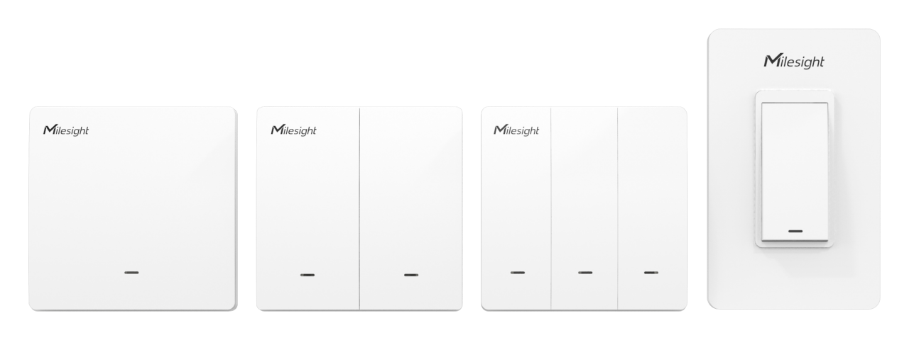

# Smart Wall Switch - Milesight IoT

The payload decoder function is applicable to WS501 / WS502 / WS503.

For more detailed information, please visit [Milesight Official Website](https://www.milesight.com/iot/product/lorawan-sensor/ws50x).

|         WS50x          |
| :--------------------: |
|  |

## Payload Definition

| CHANNEL |  ID  | TYPE | LENGTH | DESCRIPTION |
| :-----: | :--: | :--: | :----: | ----------- |
| Switch  | 0x08 | 0x29 |   1    | status(1B)  |

### Status Definition

| bits |  7  |        6        |        5        |        4        |  3  |    2     |    1     |    0     |
| :--: | :-: | :-------------: | :-------------: | :-------------: | :-: | :------: | :------: | :------: |
|      |  -  | switch_3_change | switch_2_change | switch_1_change |  -  | switch_3 | switch_2 | switch_1 |

## Example

```json
// FF2931
{
    "switch_1": "on",
    "switch_2": "off",
    "switch_3": "off",
    "switch_1_change": "yes",
    "switch_2_change": "yes",
    "switch_3_change": "no"
}
```
