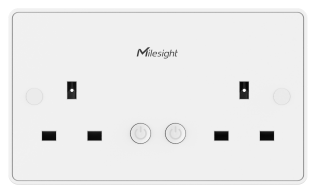

# Smart Wall Socket - Milesight IoT

The payload decoder function is applicable to WS516.

For more detailed information, please visit [Milesight Official Website](https://www.milesight.com/iot/product/lorawan-sensor/ws516).

### Attribute

| CHANNEL         |  ID  | LENGTH | DESCRIPTION                                 |
| :-------------- | :--: | :----: | :------------------------------------------ |
| TSL Version     | 0xDF |   2    | tsl_version                                 |
| Product Name    | 0xDE |   32   | custom_name                                 |
| PartNumber      | 0xDD |   32   | custom_pn                                   |
| SerialNumber    | 0xDB |   8    | sn                                          |
| Product Version | 0xDA |   8    | hardware_version(2B) + firmware_version(6B) |
| OEM ID          | 0xD9 |   2    | oem                                         |