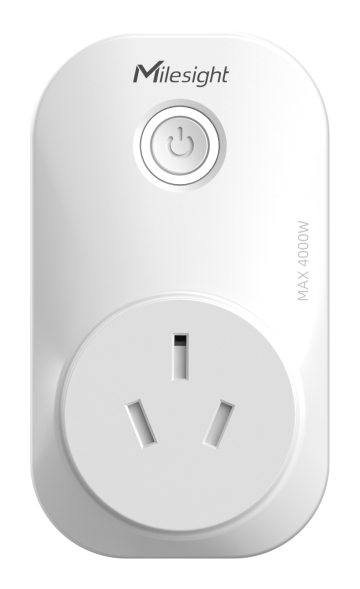
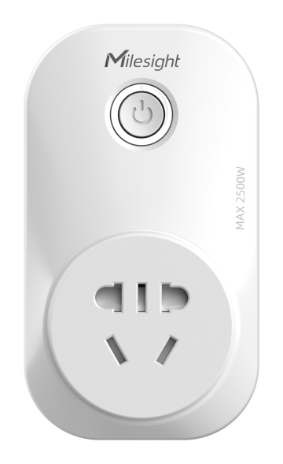
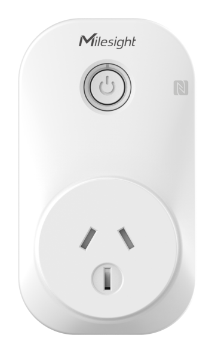
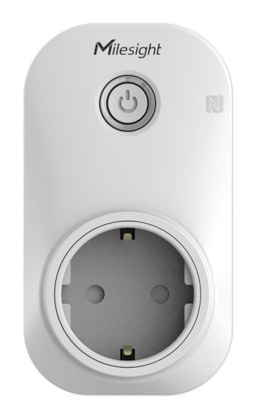

# Smart Portable Socket - Milesight IoT

The payload decoder function applies to WS52X.

For more detailed information, please visit [milesight official website](https://wwww.milesight-iot.com).

|       WS523-CN-16A       |       WS525-CN-10A       |        WS523-UK        |        WS523-US        |        WS523-AU        |        WS523-EU        |
| :----------------------: | :----------------------: | :---------------------: | :---------------------: | :---------------------: | :---------------------: |
|  |  |  |  |  |  |

## Payload Definition

|      CHANNEL      |  ID  | TYPE | LENGTH | DESCRIPTION                                                            |
| :---------------: | :--: | :--: | :----: | ---------------------------------------------------------------------- |
|      Voltage      | 0x03 | 0x74 |   2   | voltage(2B)<br />voltage, read: uint16/10                              |
|   Active Power   | 0x04 | 0x80 |   4   | active_power(4B)<br />active_power, read: uint32, unit: W              |
|   Power Factor   | 0x05 | 0x81 |   1   | power_factor(1B)<br />power_factor, read: uint8/100                    |
| Power Consumption | 0x06 | 0x83 |   4   | power_consumption(4B)<br />power_consumption, read: uint32, unit: W\*h |
|      Current      | 0x07 | 0xC9 |   2   | current(2B)<br />current, read: uint16, unit: mA                       |
|   Socket Status   | 0x08 | 0x70 |   1   | socket_status(1B)<br />socket_status, values: (0: close, 1: open)      |

## Example

```json
// 087001 05812C 07C94A00 03743009 068309660000 048007000000
{
    "active_power": 7,
    "current": 74,
    "power_consumption": 26121,
    "power_factor": 0.44,
    "socket_status": "open",
    "voltage": 235.2
}
```
