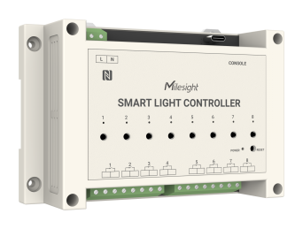
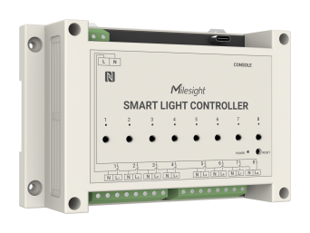

# Smart Light Controller - Milesight IoT

The payload decoder function is applicable to WS558.

For more detailed information, please visit [Milesight Official Website](https://www.milesight.com/iot/product/lorawan-sensor/ws558).

|        WS558        |        WS558-LN         |
| :-----------------: | :---------------------: |
|  |  |

## Payload Definition

|      CHANNEL      |  ID  | TYPE | LENGTH | DESCRIPTION                                            |
| :---------------: | :--: | :--: | :----: | ------------------------------------------------------ |
|      Voltage      | 0x03 | 0x74 |   2    | voltage(2B)<br />voltage, read: uint16/10              |
|   Active power    | 0x04 | 0x80 |   4    | power(4B)<br />power, read: uint32, unit: W            |
|   Active factor   | 0x05 | 0x81 |   1    | factor(1B)<br />factor, read: uint8, unit: %           |
| Power Consumption | 0x06 | 0x83 |   4    | power_sum(4B)<br />power_sum, read: uint32, unit: W\*h |
|      Current      | 0x07 | 0xC9 |   2    | current(2B)<br />current, read: uint16, unit: mA       |
|      Switch       | 0x08 | 0x31 |   2    |                                                        |

### Switch Value Definition

```
binary:  0 0 0 0 0 0 0 0  0 0 0 0 0 0 0 0
switch:  8 7 6 5 4 3 2 1  8 7 6 5 4 3 2 1
         ---------------  ---------------
bitmask:          change            state
```

## Example

```json
// 08310001 058164 07C90200 0374B208 068301000000 048001000000
{
    "voltage": 222.6,
    "active_power": 1,
    "power_factor": 100,
    "total_current": 2,
    "power_consumption": 1,
    "switch_1": "on",
    "switch_2": "off",
    "switch_3": "off",
    "switch_4": "off",
    "switch_5": "off",
    "switch_6": "off",
    "switch_7": "off",
    "switch_8": "off"
}
```
